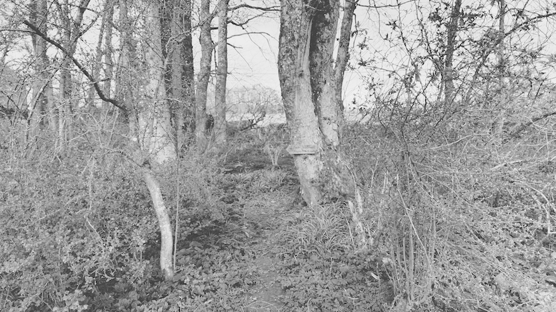
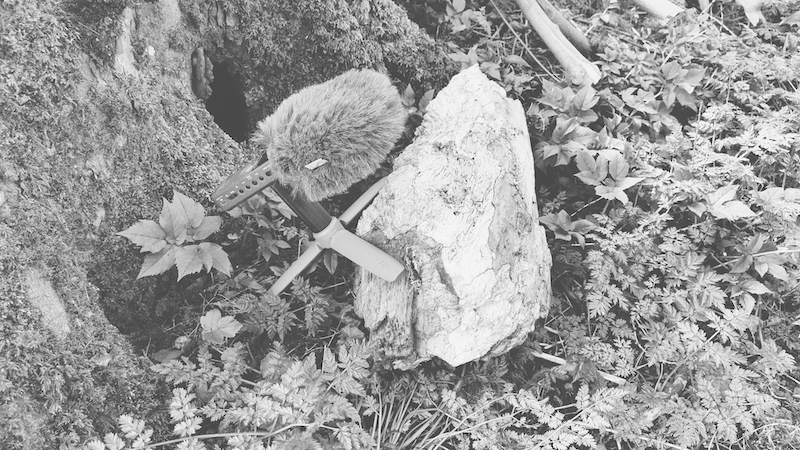
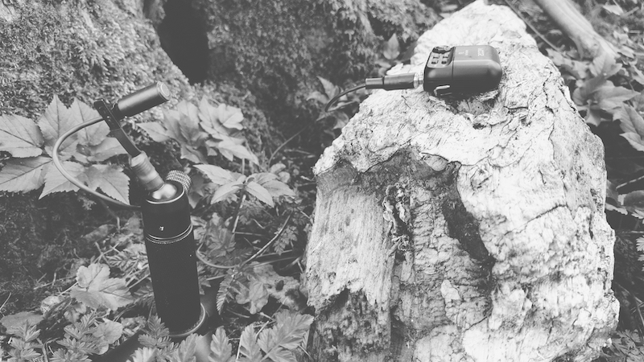

A comparison of the [Orllewin tinyfone](../../Orllewin%20tinyfone.md) (mono )and the old Zoom H1 built-in microphones (stereo). Lots of different birds and a bee on the F2 recording.

Zoom H1 with built-in stereo condenser microphones.

Zoom F2 with [Orllewin tinyfone](../../Orllewin%20tinyfone.md).

