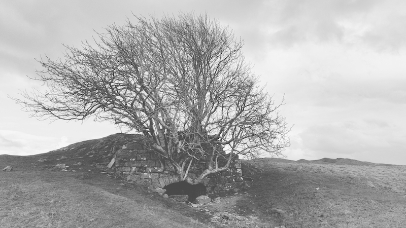
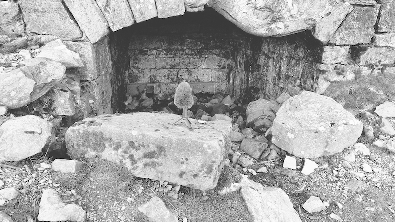
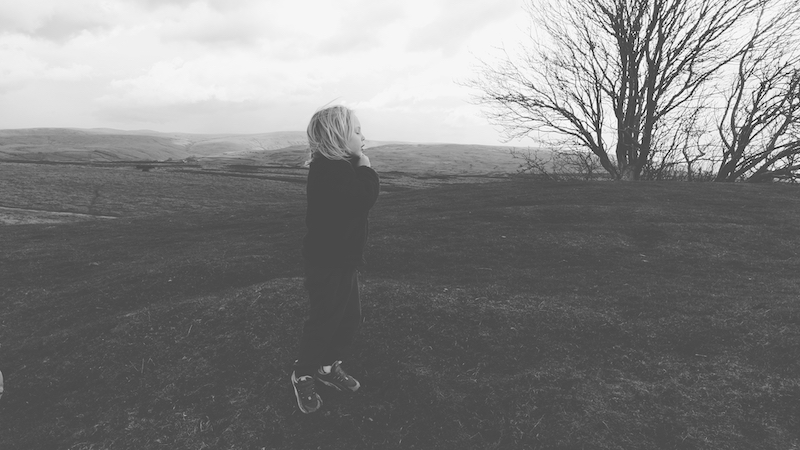
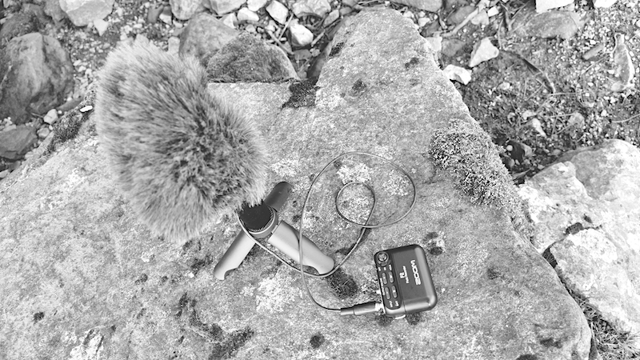

[Orllewin tinyfone](../../hardware/Orllewin%20tinyfone.md) into a Zoom F2 with foam windshield and a fluffy 'dead cat'. Lots of wind noise, but skylarks and jackdaws, and young P playing around the lime kiln too.

