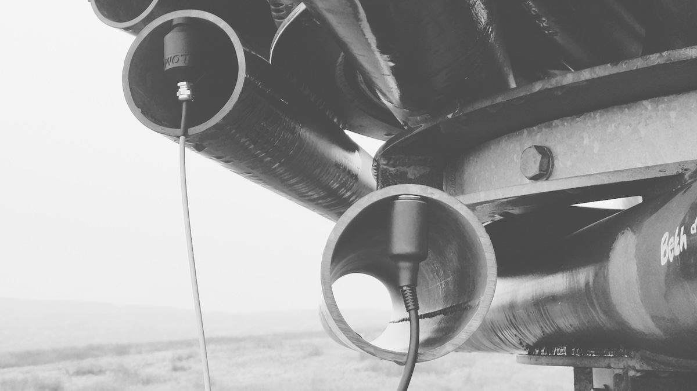

Date: Sunday 15th September

A very wet day, but wind too, which is necessary when visiting the Singing Ringing Tree.

Geophone recordings (see [Orllewin geophone](../../../shop/Orllewin%20geophone.md)), noisy and short; recorded with the old Zoom H1 which had a tiny residue of charge available before turning off repeatedly. The battery kept cutting out before I could tweak the gain from the iRig2. 

A (surprisingly decent) recording from my phone microphone:

A video from my phone too:

<iframe width="700" height="600" src="https://www.youtube.com/embed/Y88Ot0ZCCu4" title="15 September 2024" frameborder="0" allow="accelerometer; autoplay; clipboard-write; encrypted-media; gyroscope; picture-in-picture; web-share" referrerpolicy="strict-origin-when-cross-origin" allowfullscreen></iframe>

---

# Bonus mix

A mix using the Geophone recordings, pitched and stretched:

