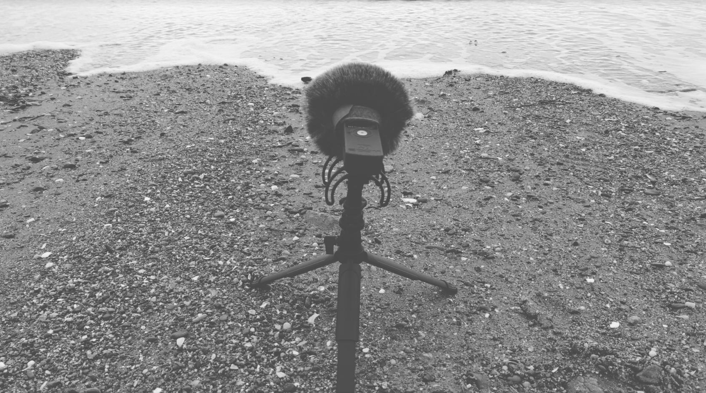

16th February 2024

Walking along the beach towards Ynys Llanddwyn on a windy day. Zoom H1 field recorder with inner foam windshield and furry outer muff. 

As above, mounted on a small tripod, pointing at the waves:

A small boy chasing waves:

