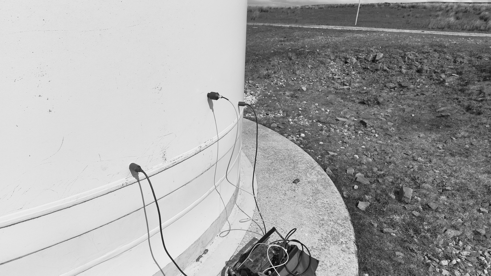

A large wind farm by Kebs Road on Long Causeway just outside Todmorden. Recording made with two [Orllewin geophone](../../../../shop/Orllewin%20geophone.md) units and a LOM Geofón connected to a Tascam DR-70D.

