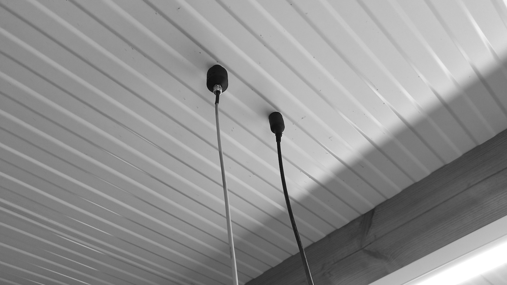
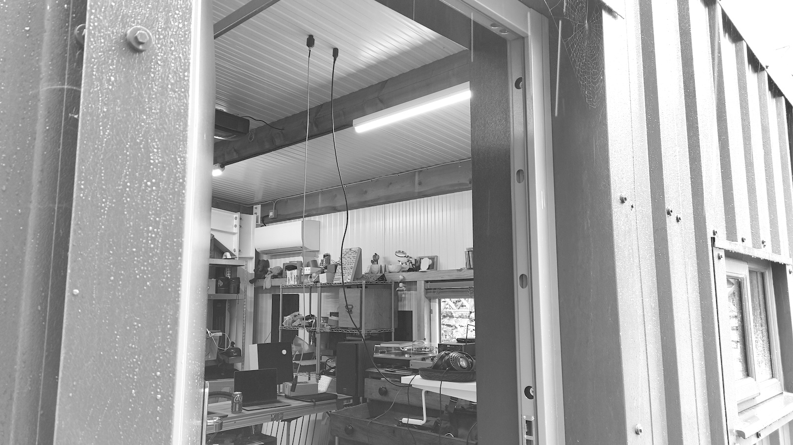
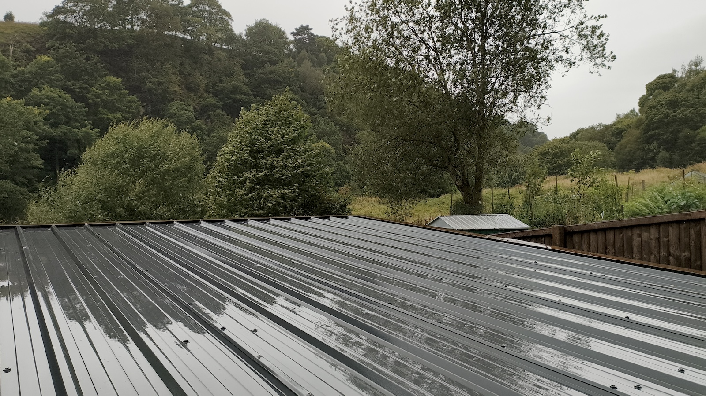
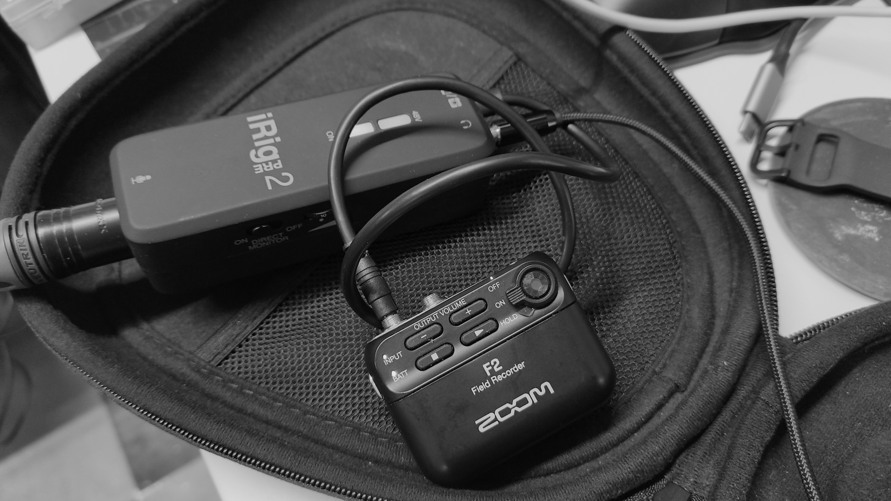

Date: 27th August 2024

Light rain and wind on the workshop roof recorded with the [Orllewin geophone](../../../../shop/Orllewin%20geophone.md) and the [Lom Geofón](https://store.lom.audio/products/geofon-diy-kit) through an iRig Pre2 into a Zoom F2.

[Orllewin geophone](../../../../shop/Orllewin%20geophone.md)

---

[Lom Geofón](https://store.lom.audio/products/geofon-diy-kit)

---

