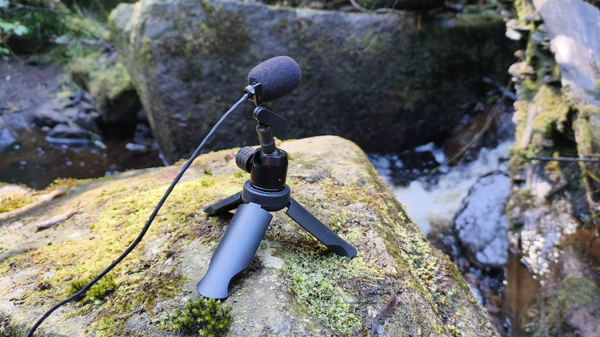
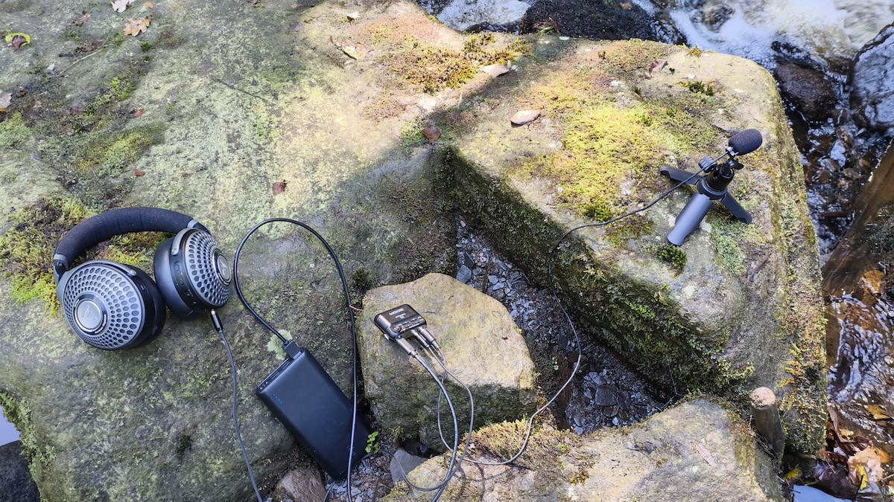

Date: Tuesday 17th September, 2024

The stream at the bottom of the clough at Pudsey Road, Todmorden. [Orllewin tinyfone](../../../../hardware/Orllewin%20tinyfone.md) straight into a Zoom F2.

---

Date: Wednesday 18th September

A second recording testing a new microphone, the [Orllewin emfone](../../../../hardware/Orllewin%20emfone.md). A handheld recording over the surface of the stream, moving the microphone in and out of nooks and crannies:

