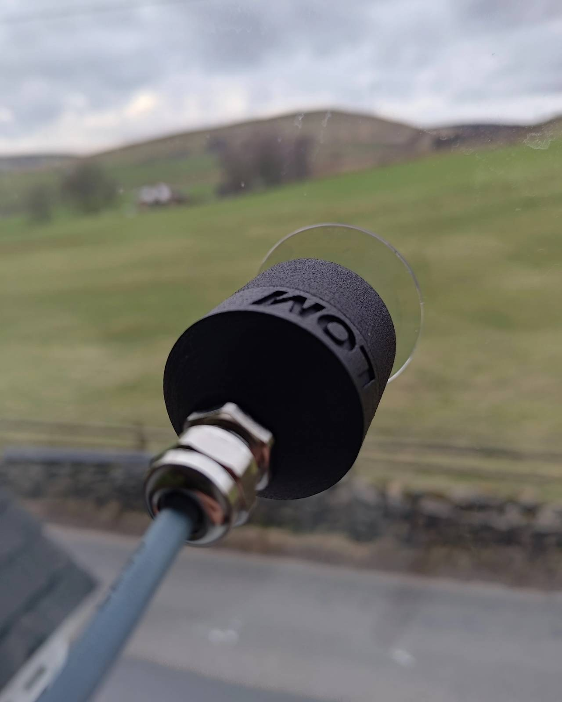
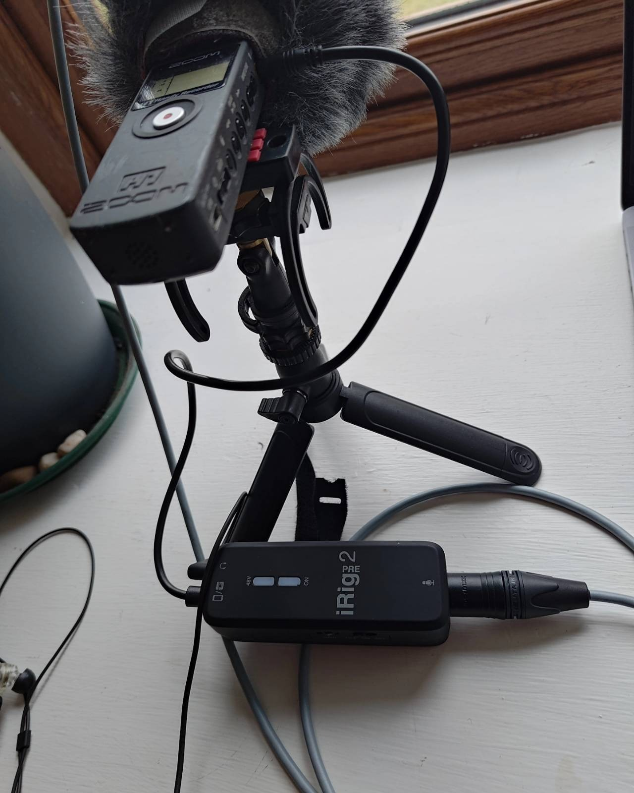

The [LOM Geofón](https://store.lom.audio/collections/contact-microphones)is a geophone seismic sensor element housed in a metal casing. 

The fridge in our house at Sourhall, Todmorden, using the magnet attachment:

and the kitchen window using the suction cup:

## Recording setup

Geofón into the iRig Pre 2, and then into the old Zoom H1:

