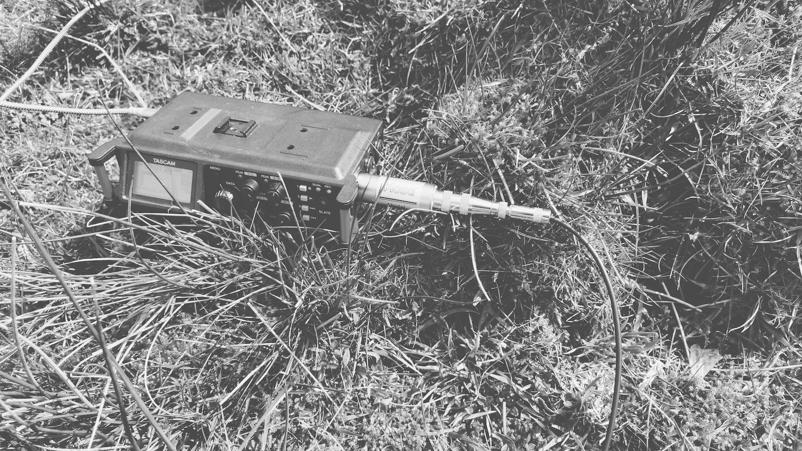

Date: 21st April 2024

Quick comparison of recording the [Jez Riley French hydrophone (3.5mm jack version)](https://jezrileyfrench.co.uk/hydrophones.php) with various different kit to hear the difference the [Hosa MIT-129 Impedance Transformer](https://hosatech.com/products/analog-audio/microphone-adapters/mit-129/) makes. 

Recorded at the Tomorden Moor drainage channel by the cattle grid at Sourhall, Todmorden.

Hydrophone into MIT-129 then the Tascam DR-70D, amplified 5 dB post:

Hydrophone direct into a Zoom F2, amplified 15dB:

Hydrophone into MIT-129 then iRig Pre2, then the Zoom F2:

Hydrophone direct into a Zoom H1:

