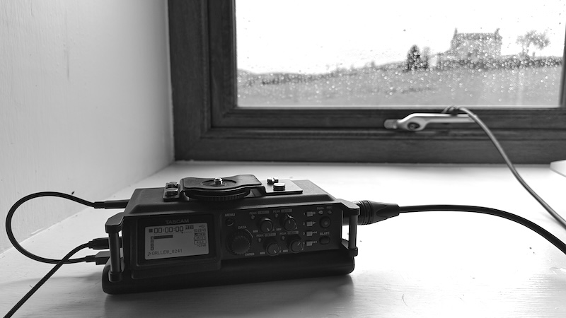
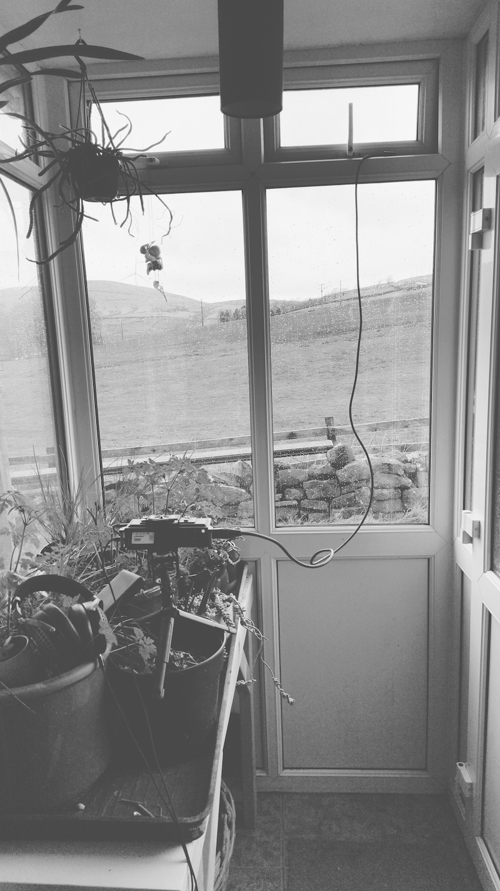

Recording with the [Orllewin geophone](../../../../shop/Orllewin%20geophone.md) during a pretty wild storm.

Orllewin geophone into a Tascam DR-700, mixed together with the DR-700 built-in microphones:

Orllewin geophone into a Tascam DR-700, too much low cut:

Orllewin geophone into a iRig Pre2, then a Zoom H1, note the noise from the Zoom preamp:

