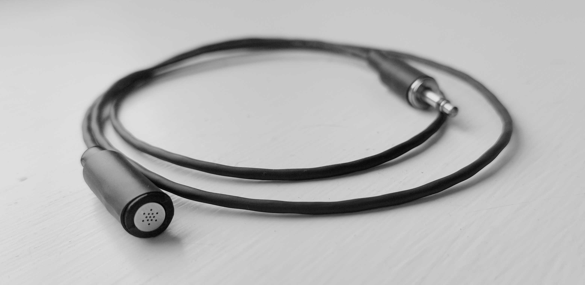
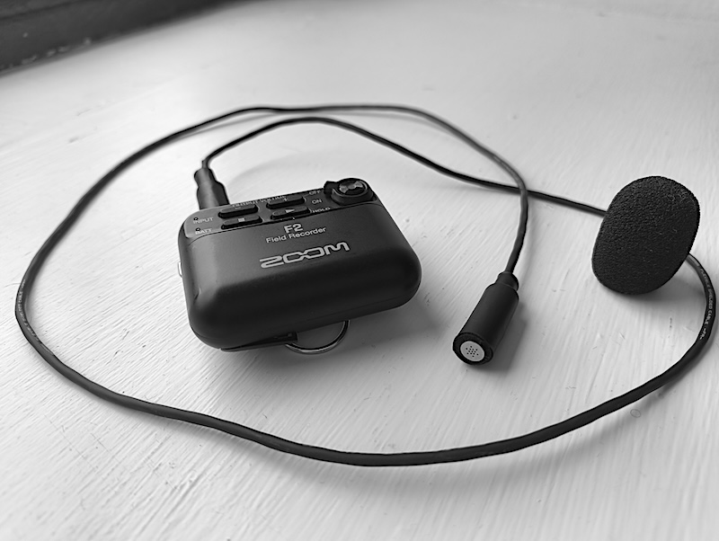
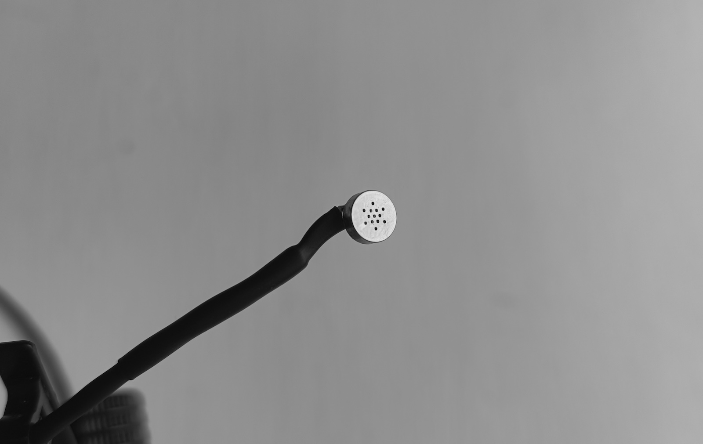
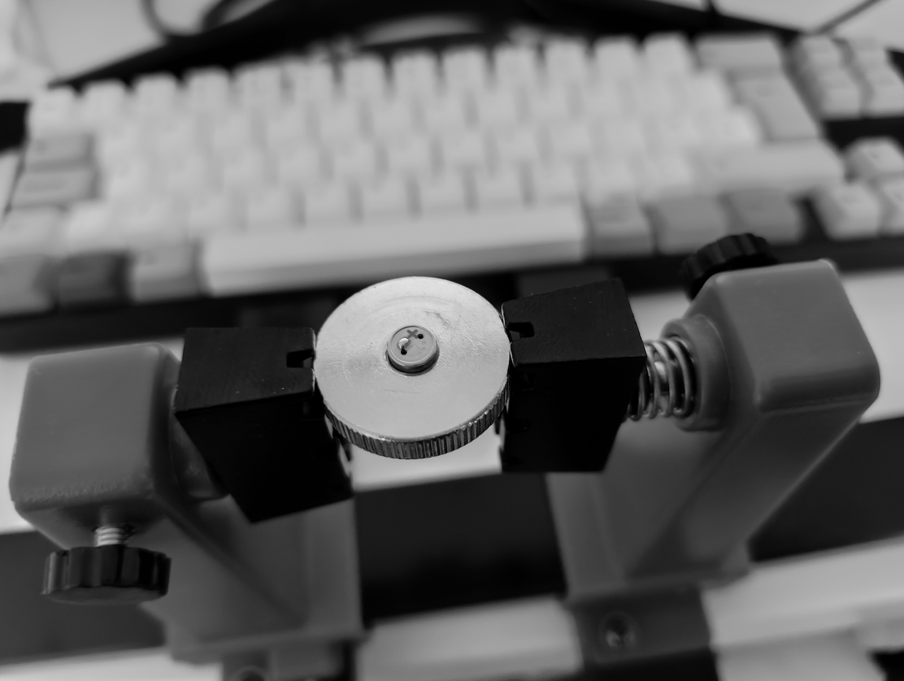

The _Orllewin tinyfone_ is built around the Primo EM-265 microphone capsule, with high quality Mogami shielded cable and a metal TS/mono 3.5mm jack.

Test recording straight into the Zoom H1 with all preamp settings off, excessive noise from the H1's preamp (apparently it's notorious for it, thanks inkydigit for the heads-up):

Recordings from the Zoom F2 have much lower noise. Recorded as below with foam windscreen:

The soldering was a challenge, I'd read these transducers needed to be soldered quickly to reduce chance of internal heat damage, to help with this I used an alloy thumbwheel from a camera tripod as a heat sink. The solder pads were only around 1x2mm, tiny, but some solder paste helped and it was more straightforward than I expected. I used a [Pinecil from Pine64](https://pine64.org/documentation/Pinecil/) with the default tip.

The model of the microphone element is: _Primo EM-265 Uni-Directional Cardioid Electret Condenser Microphone Capsule_

