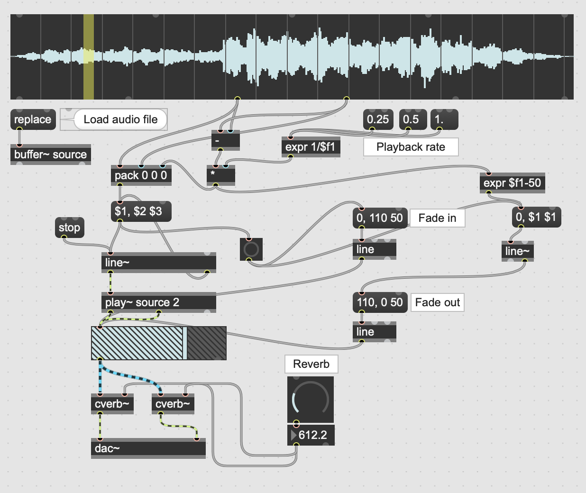
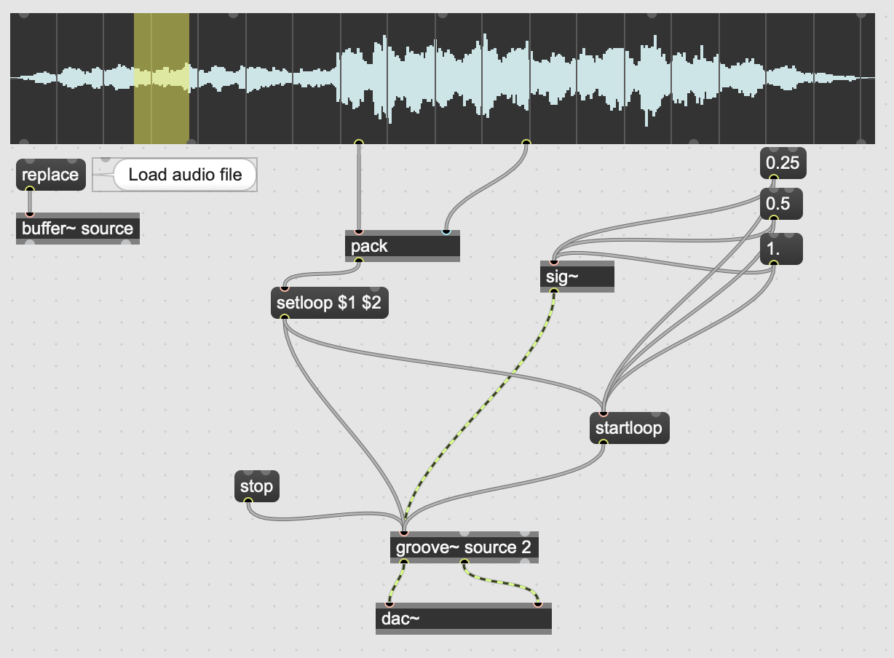
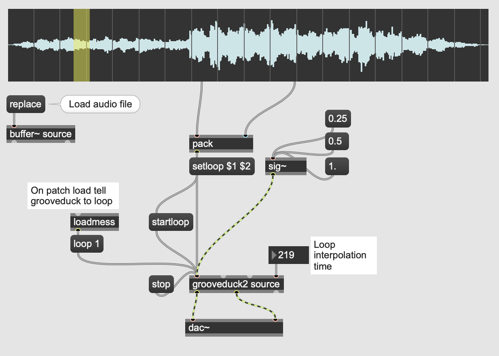

Getting a smooth click-less loop from a buffer, with variable playback rate.

**TLDR; use grooveduck2**

## Using `play~`

The `play~` object _can_ play a buffer at different rates using`line~`:

Parameters for `line~`: the first int is the start point of the range in ms, the second int is the end point of the range, and the final int is how long it should take. So in order to create a dynamic loop playing at half rate you'd need to get the start point, the endpoint, calculate the difference and divide by two. The patch below is elegant, but it doesn't have loop interpolation, the line re-triggers itself on completion, so there are generally audible clicks, to get around this there's some logic to control a gain object when the sample is re-triggered and 50ms before it loops again. This 'ducks' the audio over 100ms, 50ms fade in, and 50ms fade out, hiding any click, but means you probably need to mask the silence with some reverb.

Download: [bs_buffer_loop_rate.maxpat](https://orllewin.github.io/maxmsp/patches/bs_buffer_loop_rate.maxpat)

## Using `groove~`

The `groove~` object can do this trivially, but `groove~` doesn't allow setting the loop interpolation time, which means loops have clicks:

Download: [bs_buffer_loop_rate_groove.maxpat](https://orllewin.github.io/maxmsp/patches/bs_buffer_loop_rate_groove.maxpat)

## Using `grooveduck2~`
 `grooveduck2` _does_ allow setting a wider time for the loop interpolation:

Download: [bs_buffer_loop_rate_grooveduck2.maxpat](https://orllewin.github.io/maxmsp/patches/bs_buffer_loop_rate_grooveduck2.maxpat)

**Note. make sure to use grooveduck2, grooveduck is mono, grooveduck2 is stereo**