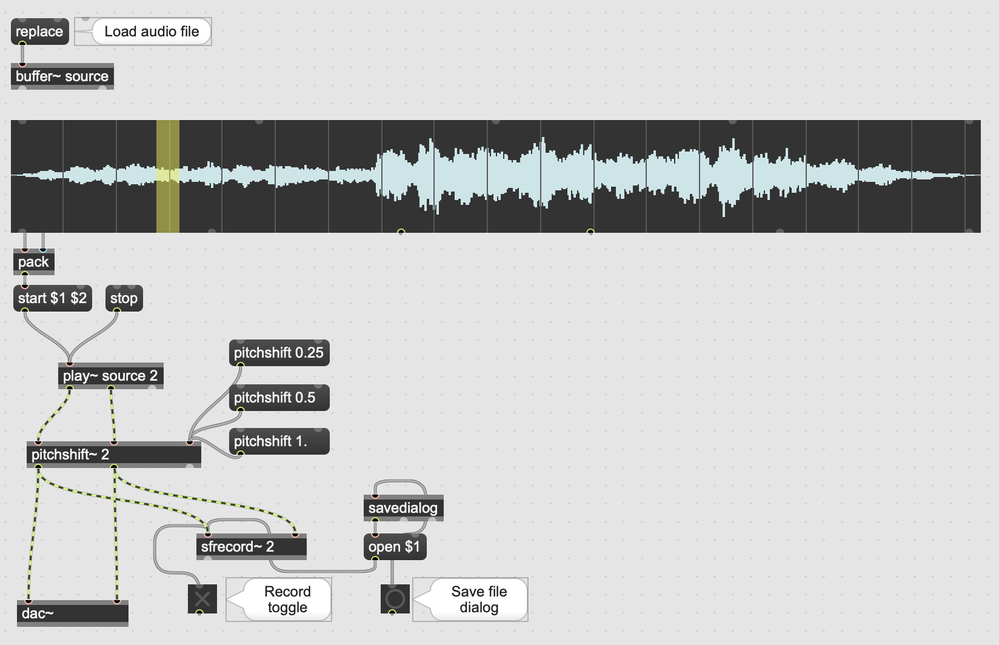

Load audio into a buffer, grab the length in milliseconds and set as max value for the two loop position encoders. 

Download: [bs_buffer_loop.maxpat](https://orllewin.github.io/maxmsp/patches/bs_buffer_loop.maxpat)

