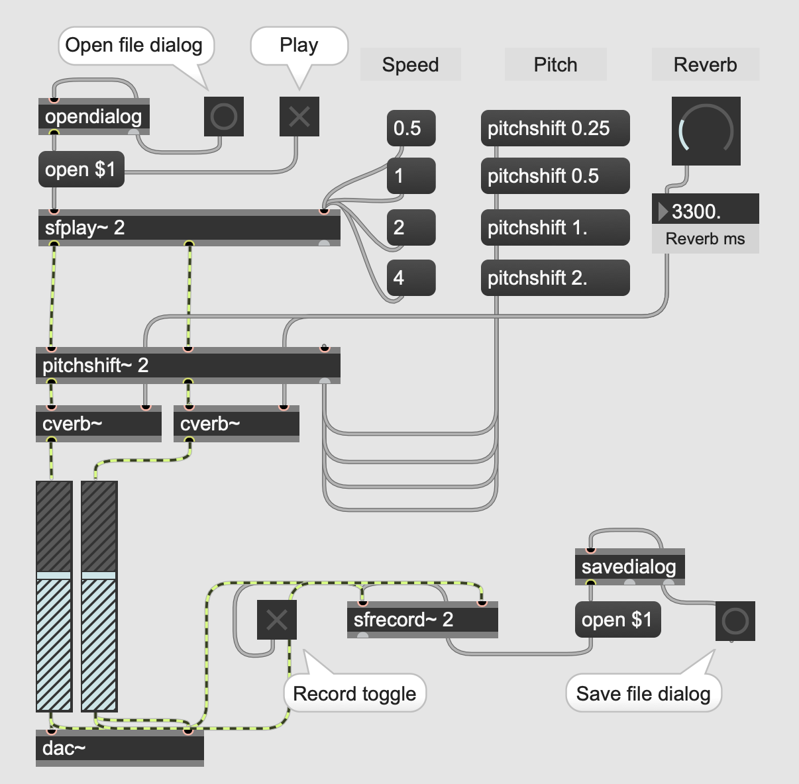

Download: [bs_pitch_reverb.maxpat_file](https://orllewin.github.io/maxmsp/patches/bs_pitch_reverb_file.maxpat)

Example output (using Firth of Tay from [Netlabel years](../../music/Netlabel%20years.md)):

