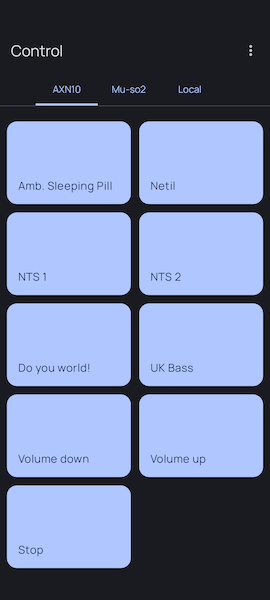
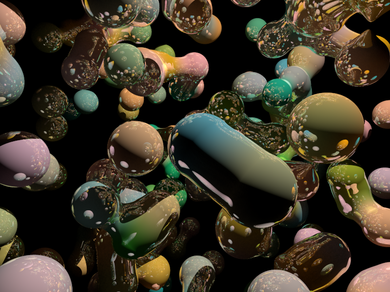

## 21

We've been away in Anglesey, and the kids have been as full-on as ever, as has work. I have changed the ui in [Control](../computers/software/Control.md) to use tabs instead of a long scrollable single screen, this is better UX, but also less resource intensive, it now feels much more correct:

I'm undecided on how far to go with [Control](../computers/software/Control.md), it's perfect for my own personal but if I release it as a paid app I'll have to support users and fix bugs.

I spent more time with POV-Ray, before catching myself spending too much time in it:

## 13

More chaotic life happenings and crunch time at work so I've not updated for a while. I'm still enjoying playing with POV-Ray when I can find the time though. Latest is [POV-Ray Kotlin script blobgen](../computers/graphics/povray/POV-Ray%20Kotlin%20script%20blobgen.md)

## 06

POV-Ray Quaternion Julia Fractals with a [Lento](../computers/software/Lento.md) photo of Ratten Clough, Todmorden

