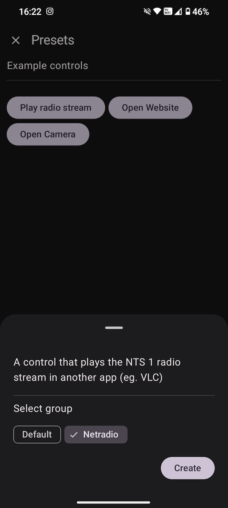
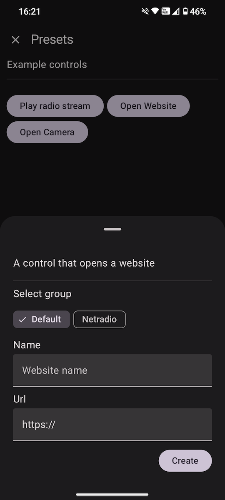
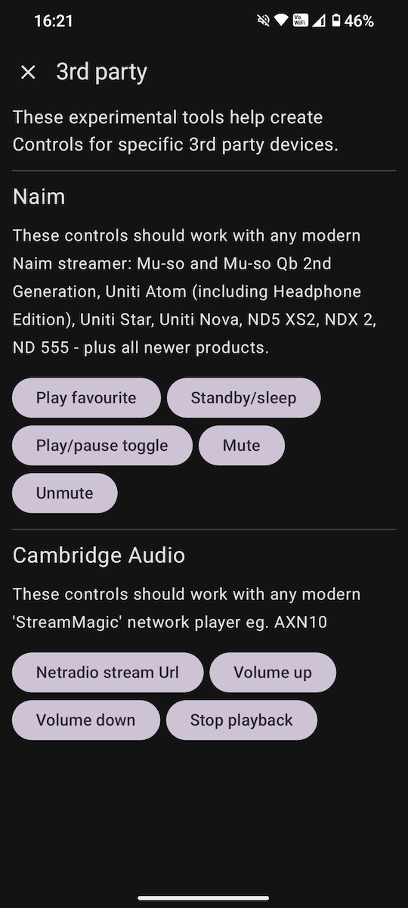
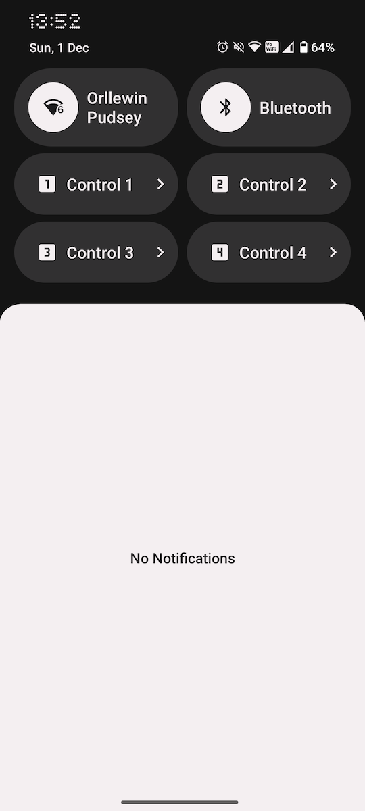

A second [December Adventure](https://eli.li/december-adventure). I did this last year too: [2023 12](2023%2012.md). Posts are in reverse order, latest first.

## 23

As expected I've not found much time for project work this year. I did buy an old Squire Stratocaster from an older local lady, she'd bought it for her son 20 years ago who soon lost interest. I played a lot of electric guitar in my youth (when I was obsessed with Joe Satriani and Steve Vai (and Vai era David Lee Roth), and continued to play my Dad's acoustic for the last 30+ years since his death, so I'm enjoying having an electric again, also uploaded to this new page is a drone made on Playdate with my own Modular Play software: [Experiments](../audio/music/Experiments.md)

## 10 to 13

Travelling by train to Salisbury for a 4 day on-site work visit. I'm the only person wearing a mask. 

Not much time for anything other than work. I did manage to improve the main game-loop in [Coracle compose](../software/Coracle%20compose.md) which I'll push soon, it now runs with a stable frame-rate, previously it'd initialise with a quick rate then settle down, possibly from 60fps, to 30fps, looks like it now maintains a steady 30fps.
## 9 

The weekend was all family, and one nighttime walk. I've realised there might be a problem with my plan to integrate Control controls with Android Auto; the media browser/library expects a 'playable' leaf in the catalogue tree to be... playable. Whereas I want to carry out some arbitrary action, I'm not sure I can terminate the playable tap without showing an error. The use case is where you have a control that opens an audio app and tells it to play a net-radio station (VLC in my case). We'll see what happens when I implement it.


## 6

It's Friday and I'm trying to wrap up a feature at the day job, plus my youngest is off school with a bug, so I may not find time for any personal project development.
## 5 

The quick settings tiles are done - other than one huge bug; I create two different tiles pointing at two different controls and they both trigger the first. Hopefully it'll be a simple thing to resolve and not anything deeper. In parallel to fixing that I'm going to start with Android Auto integration.

## 4

Yesterday I got the quick tiles working well, but it was tricky to manage the state; which tile was assigned to which control. I've realised the cleanest way to manage this is to only allow overwriting, and not have the ability to remove a control from a tile. So the new plan is to show an overview of the tiles when editing a control, and if the user selects an occupied tile show a confirmation dialog before overwriting. That removes 90% of the complexity and keep the UX as simple as possible for the user, and it means I can delete a load of code too which always feels good. I've got a complication to fix with the callbacks when you add a tile - if you cancel the native dialog it's still reporting as a success, so in-app state gets confused. 

## 3

I have a cold/the flu/COVID, so I am grumpier than usual. 

I've got quick setting tiles working with some bad compromises. Your `TileService` implementation shouldn't do any work of it's own, it's just a mechanism to add some extras to an intent and then call an Activity, if you do try and do work in the service you run into weird blocking errors, nothing happens until the quick settings panel collapses, so instead of having this in the `TileService`:

```
executorRepository.intentExecutor(control).execute { response, error ->  
    println("ControlTileService: onClick(): executed, response: $response error: $error")  
}
```

I need to simply add the `controlId` to an intent and let a standard Android Activity do the work. Just to get it working though I found a post on Stack Overflow where just displaying an empty dialog and dismissing it immediately causes the quick settings panel to collapse, it's awful, but at least I got to quickly see my controls firing from a quick settings tile. 

Doing things properly, in the `TileService` I reuse an existing Activity, `AppShortcutActivity` that expects a `shortcutId` extra (Controls were originally Shortcuts), this worked perfectly:

```
@SuppressLint("StartActivityAndCollapseDeprecated")  
override fun onClick() {  
    super.onClick()  
    println("ControlTileService: onClick(): index: $index")  
  
    scope.launch {  
        val controldId = TilesDatastore(baseContext).getTileControlId(index)  
        println("ControlTileService: onClick(): controldId: $controldId")  
        if (controldId != null) {  
  
            val intent = Intent(baseContext, AppShortcutActivity::class.java).apply {  
                putExtra("shortcutId", controldId)  
                addFlags(Intent.FLAG_ACTIVITY_CLEAR_TASK or Intent.FLAG_ACTIVITY_NEW_TASK)  
            }  
  
            if (Build.VERSION.SDK_INT >= Build.VERSION_CODES.UPSIDE_DOWN_CAKE) {  
                val pendingIntent = PendingIntent.getActivity(  
                    baseContext,  
                    0,  
                    intent,  
                    PendingIntent.FLAG_IMMUTABLE  
                )  
  
                startActivityAndCollapse(pendingIntent)  
            }else{  
                startActivityAndCollapse(intent)  
            }
```

Next job is to manage the tiles better in the UI.
## 2

Onboarding now has some easy options to get into the app quickly without having to navigate/understand the full control creation screen:

| Updated onboarding screen                  | Create a web link control from onboarding  |
| ------------------------------------------ | ------------------------------------------ |
|  |  |

## 1

For December Adventure this year I expect to have far less free time than last year where I was particularly productive. Since then we've moved house, work has had some times of slight chaos, I need to make sure I'm exercising enough, and the kids are a year older. Free time for coding adventures is short.

I have my ongoing [Control](https://orllewin.uk/control/) project which I use instead of 1st party apps (including my own day-job one!) for controlling audio streamers, it's a rare personal project in that it has a pretty solid foundation, there's little technical debt, which makes dipping in and out sporadically much easier than my usual tech-itch-that-needs-scratching projects. 

There's some fundamental things I need to do before anyone else can use it, the onboarding process is old, and doesn't include the newer presets feature where some predefined behaviours have small setup wizards. So that's the first task. 

| Preset to play NTS1                 | Preset to open a website            | 3rd party presets                   |
| ----------------------------------- | ----------------------------------- | ----------------------------------- |
|  |  |  |

After onboarding I'd like to be able to assign controls to an Android Quick Setting tile. You can't spawn as many of these as you like, and the guidelines recommend an app should only have two, they're meant to be hard-coded actions doing a specific task. I've declared four in the app manifest so need to write a mechanism to assign them each to a control. 



If all that happens quickly enough I also want to be able to surface assigned controls in Android Auto - a lot of controls wont make sense in a car, but some do, for example: a control that launches a net-radio stream on VLC via an Intent.