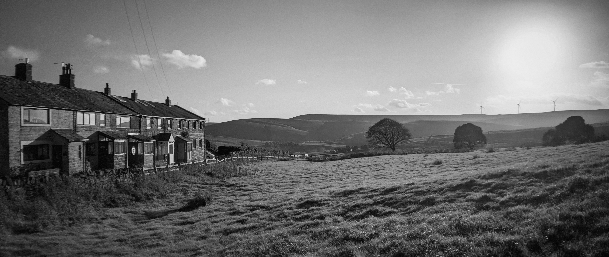
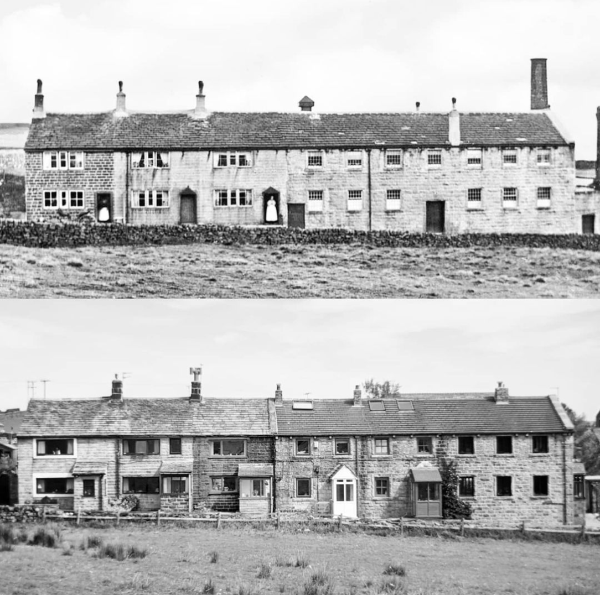
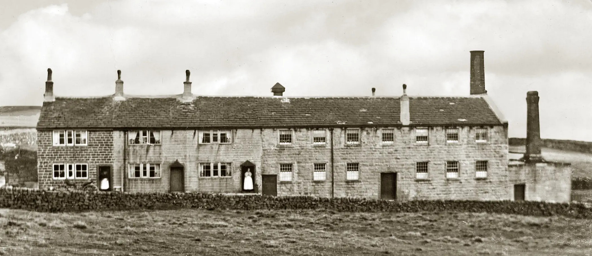
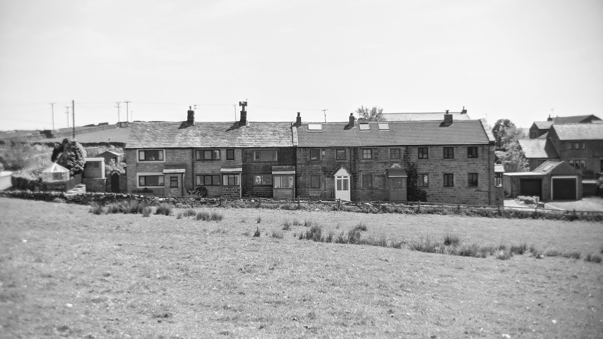
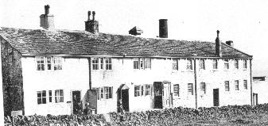
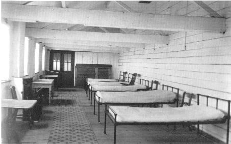

For 9 years we lived in a small hamlet called Sourhall which is in Todmorden, West Yorkshire. Our house was a terrace in what used to be a mill, and then a [smallpox isolation hospital](https://sites.rootsweb.com/~todmordenandwalsden/sourhallhospital.htm), before being converted to 6 houses in the late 1980s

Then, and now, I took the second photo in June 2021 using a Moment Telephoto lens to match the optics of the old 1900s camera lens:

## Isolation Hospital

The old hospital whitewash below is still visible on the attic beams today:

Above photo from [Pennine Horizons](https://penninehorizons.org/items/show/36970). I believe the chimney to the left was built for a crematorium. Number 4 Sourhall Cottages own a 'garage' just out of picture to the left which was the morgue. It still has tiled walls and a concrete floor with a drain down the middle.

 Photo again from [Pennine Horizons](https://penninehorizons.org/items/show/22726)showing the sorry state of Sourhall around 1984 before the mill end was converted to houses. It looks like the beautiful old stone roofing was stolen or sold, leaving the interior exposed. The end three houses to the right still have the old stone roof today.