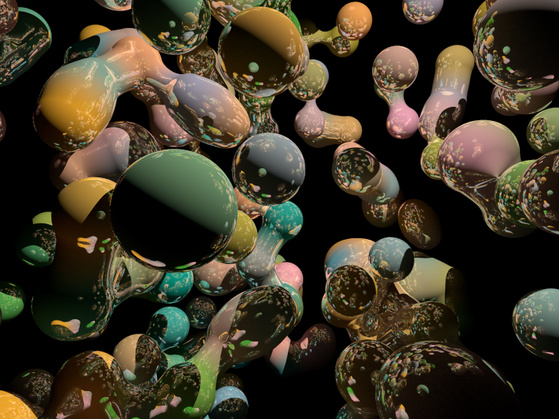

A [Kotlin script](../../Kotlin%20script.md) to generate random POV-Ray Blob scenes:

```
#!/usr/bin/env kotlin

import java.lang.StringBuilder
import java.nio.file.Files
import java.nio.file.Paths
import kotlin.math.cbrt
import kotlin.math.sqrt
import kotlin.random.Random

data class Vector(val x: Float, val y: Float, val z: Float) {
    constructor(x: Double, y: Double, z: Double) : this(x.toFloat(), y.toFloat(), z.toFloat())

  override fun toString(): String {
    return "<$x, $y, $z>"
  }

  companion object {
    fun zero(): Vector {
      return Vector(0f, 0f, 0f)
    }

    fun white(): Vector {
      return Vector(1f, 1f, 1f)
    }
  }
}

class Scene {

  private val sb = StringBuilder()

    fun add(any: Any) {
      sb.append(any.toString())
    }

    fun build(): String {
      return sb.toString()
    }

    fun bytes(): ByteArray {
        return build().toByteArray()
    }
}

class Radiosity(val active: Boolean, val highQuality: Boolean) {
    override fun toString(): String {
        val radOn: String = when {
            active -> "on"
            else -> "off"
        }
        val hqOn: String = when {
            highQuality -> "on"
            else -> "off"
        }
        return "#declare rad = $radOn;\n" +
                "#declare hqRad = $hqOn;\n" +
                "\n" +
                "global_settings {\n" +
                "\t#if(rad)\n" +
                "\tradiosity {\n" +
                "\t\t#if(hqRad)\n" +
                "\t\tpretrace_start 0.08\n" +
                "      \tpretrace_end   0.01\n" +
                "      \tcount 500\n" +
                "\n" +
                "      \tnearest_count 10\n" +
                "      \terror_bound 0.02\n" +
                "      \trecursion_limit 1\n" +
                "\n" +
                "      \tlow_error_factor 0.2\n" +
                "      \tgray_threshold 0.0\n" +
                "      \tminimum_reuse 0.015\n" +
                "      \tbrightness 1\n" +
                "\n" +
                "     \t\tadc_bailout 0.01/2\n" +
                "      \t#end\n" +
                "\t}\n" +
                "     #end\n" +
                "}"
    }
}

class Camera(val location: Vector, val lookAt: Vector) {
    override fun toString(): String {
        return "camera {\n\tlocation $location\n\tlook_at $lookAt\n}\n\n"
    }
}

class Light(val position: Vector, val colour: Vector) {
    override fun toString(): String {
        return "light_source { \n\t$position rgb $colour\n}\n\n"
    }
}

class Finish(val ambient: Float, val diffusion: Float, val reflection: Float) {
    override fun toString(): String {
        return "finish {\nambient $ambient\ndiffuse $diffusion\nreflection $reflection\n}\n"
    }

    companion object {
        fun default(): Finish {
            return Finish(0.075f, 0.9f, 0.9f)
        }
    }
}

class Colour(val r: Float, val g: Float, val b: Float) {
    override fun toString(): String {
        return "color rgb <$r, $g, $b>"
    }
}

class Background(val r: Float, val g: Float, val b: Float) {
    override fun toString(): String {
        return "background {${Colour(r, g, b)}}\n\n"
    }

    companion object {
        fun black(): Background {
            return Background(0f, 0f, 0f)
        }
    }
}

class Pigment(val r: Float, val g: Float, val b: Float) {
    override fun toString(): String {
        return "pigment {${Colour(r, g, b)}}"
    }

    companion object {
        fun random(): Pigment {
            return Pigment(
                Math.random().toFloat(),
                Math.random().toFloat(),
                Math.random().toFloat()
            )
        }

        fun randomBlueGreen(): Pigment {
            return Pigment(0.4f, Math.random().toFloat(), Math.random().toFloat())
        }

        fun randomRedBlue(): Pigment {
            return Pigment(Math.random().toFloat(), 0.4f, Math.random().toFloat() / 2)
        }

    }

}

class Texture(val pigment: Pigment, val finish: Finish) {
    fun toPovRayObject(): String {
        return "texture{\n$pigment\n$finish\n}"
    }
}

class BlobSphere(val vector: Vector, val radius: Float, val texture: Texture? = null) {
    fun toPovRayObject(): String {
        return if (texture != null) {
            "sphere {\n\t<${vector.x}, ${vector.y}, ${vector.z}>, $radius, 1\n${texture.toPovRayObject()}\n}\n"
        } else {
            "sphere {\n\t<${vector.x}, ${vector.y}, ${vector.z}>, $radius, 1\n}\n"
        }
    }
}

fun randomSpherePoint(m: Float): Vector {
    var x = Random.nextDouble(-1.0, 1.0)
    var y = Random.nextDouble(-1.0, 1.0)
    var z = Random.nextDouble(-1.0, 1.0)
    val mag = sqrt(x * x + y * y + z * z)
    x /= mag
    y /= mag
    z /= mag
    val c = cbrt(Math.random())
    return Vector(x * c * m, y * c * m, z * c * m)
}

val scene = Scene()

println("\nKotlinScript POV-Ray Random Blob Scene Generator")

scene.add(Radiosity(active = true, highQuality = true))
scene.add(Camera(Vector(0f, 0f, -5f), Vector.zero()))
scene.add(Light(Vector(2f, 4f, -3f), Vector.white()))
scene.add(Background.black())

val sceneBlob = "blob {\n" +
        "  threshold 0.60\n" +
        "   _SPHERES_\n" +
        "  scale 1.75\n" +
        "  finish {\n" +
        "    ambient 0.9\n" +
        "    diffuse 0.5\n" +
        "    reflection .82\n" +
        "  }\n" +
        "}\n"

val blobSphereSB = StringBuilder()
repeat(200) {
    val sceneBlobSphere =
        BlobSphere(randomSpherePoint(2f), 0.3f, Texture(Pigment.randomRedBlue(), Finish.default()))
    blobSphereSB.append(sceneBlobSphere.toPovRayObject())
}

scene.add(sceneBlob.replace("_SPHERES_", blobSphereSB.toString()))

Files.write(Paths.get("./povray_kotlinscript.pov"), scene.bytes())
println("Finished\n")

ProcessBuilder().command("open", "povray_kotlinscript.pov").start()
```