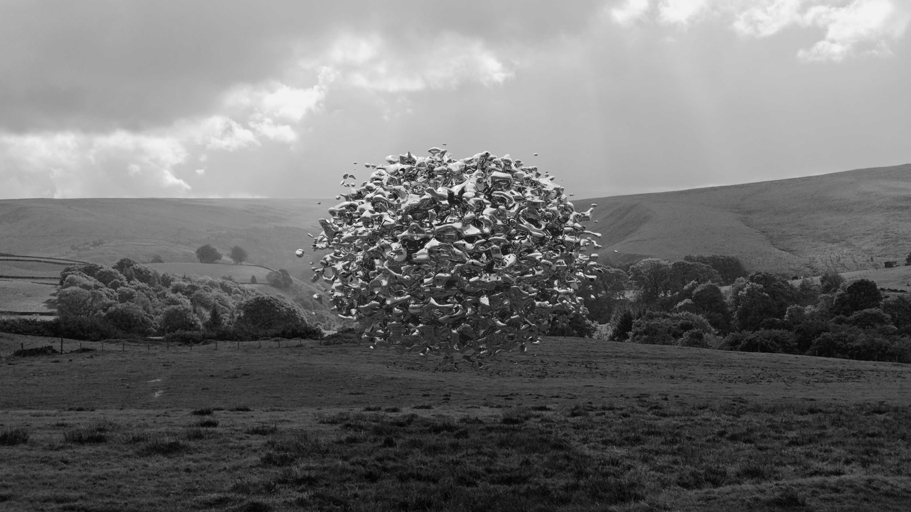

The scene uses the background black and white photo `source.png` for the object reflections. Rendered with an alpha channel and then composited with the source image in an image editor. The shadow is just another copy of the render filtered and scaled and laid over the grass with transparency.

```
#include "functions.inc"

global_settings { assumed_gamma 2.2 }

camera {
	location <0, 0, -8>
	direction <0, 0, 1.2071>
	look_at <0, 0, 0>
}

//Similar to sky_sphere but with no_image set so it doesn't draw
sphere {
	0,1.3
	pigment {
		image_map {
			png "source.png" once interpolate 2 map_type  1
		}
	}
	
	finish {
		emission 1.2
	}
  	
	scale 30
	hollow
	no_image
}


isosurface {
	function { 
		f_sphere(x, y, z, 1.2)  - f_noise3d(x * 5, y * 5, z * 5) * 1.9 
	}

	contained_by { 
		box { -5, 5 } 
	}

	max_gradient 5

	finish {
		ambient 0.9
		diffuse 0.5
		reflection .85
	}
}
```

If you want to skip the post-processing you can use `Screen_Plane` from `screen.inc` to draw an image as the background, it's more immediate but you lose the option of changing the render exposure/contrast, composition, etc:

```
#include "screen.inc"
#include "functions.inc"

global_settings { assumed_gamma 2.2 }

camera {
	location <0, 0, -8>
	direction <0, 0, 1.2071>
	look_at <0, 0, 0>
}

Screen_Plane (
	texture {
 		pigment {
  			image_map {
   				png "source.png"
  			}
 		}
 		finish {
  			ambient 1
  			diffuse 0
 		}
	}, 10000, <0,0>, <1,1>)

//Similar to sky_sphere but with no_image set so it doesn't draw
sphere {
	0,1.3
	pigment {
		image_map {
			png "source.png" once interpolate 2 map_type  1
		}
   	}
	
	finish {
		emission 1.2
	}
  	
  	scale 30
	hollow
	no_image
}


isosurface {
	function { 
		f_sphere(x, y, z, 1.2)  - f_noise3d(x*5, y*5, z*5) * 1.9 
	}

	contained_by { 
		box { -5, 5 } 
	}

	max_gradient 5

	finish {
		ambient 0.9
		diffuse 0.5
		reflection .85
	}
}
```

