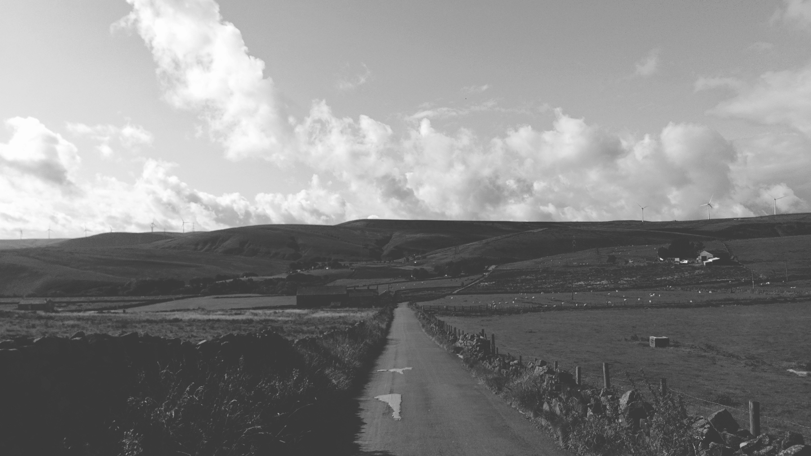
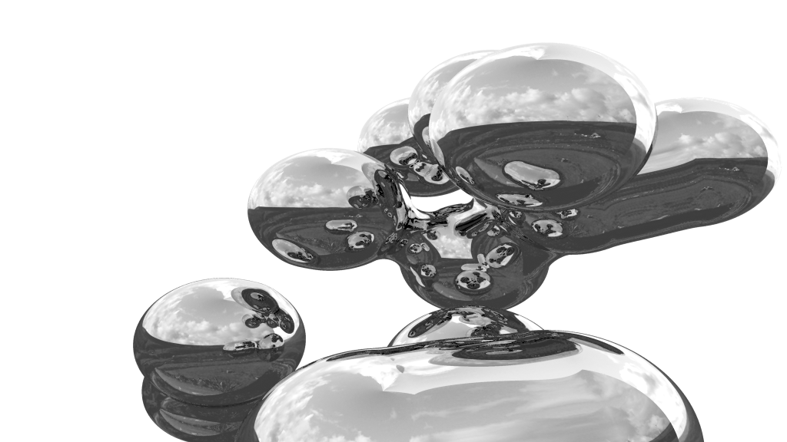
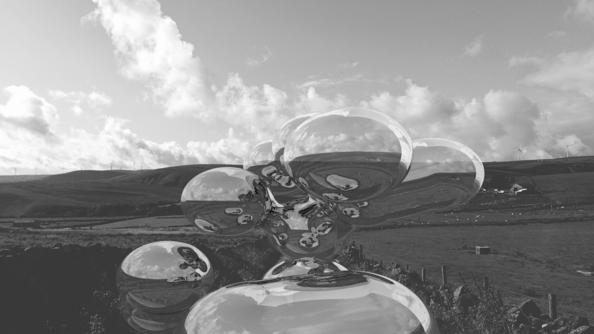

## About

Exploring POV-Ray again 20 years later.

## Download POV-Ray

I use MacOS so downloaded a build via [povrayunofficial.wordpress.com](https://povrayunofficial.wordpress.com/), there's a recently compiled version ([hosted on Google Drive here](https://drive.google.com/drive/folders/1EIko3hV9vF_7UTBG0-fsLJ0f5Wy85_2S)) which has some nice additional native features.

## Source image

Choose a source image. eg:



## .pov file

Save the source image in a directory with a POV-Ray source file, `blobmap.pov`:

```
// Persistence Of Vision raytracer version 3.8
// Blob shape with environment map example
#declare imageFile = "source.png";
global_settings { assumed_gamma 2.2 }

camera {
  location <0, 0, -5>
  direction <0, 0, 1.2071>
  look_at <0, 0, 0>
}

//Similar to sky_sphere but with no_image set so it doesn't draw
sphere {
  0,1.3
    pigment {
      image_map {
        png imageFile once interpolate 2 map_type  1
      }
   }
  finish {
    emission 1.2
  }
  scale 30
  hollow
  no_image
}

blob {
  threshold 0.60
   sphere { <.75, 0, 0>, 1, 1 }
    sphere { <-.375, .64952, 0>, 1, 1 }
    sphere { <-.375, -.64952, 0>, 1, 1 }
  scale 1.75
  finish {
    ambient 0.9
    diffuse 0.5
    reflection .82
  }
}
```

## Render settings

In the MacOS POV-Ray GUI navigate to Main Menu > Settings > Image & Quality and set Image Type as PNG and toggle 'Add Alpha Channel' to on. Click Render.



## Final image build

Combine the rendered image with the source image in any image editor, I used Figma and tweaked the 3D image slightly, made it slightly semi-transparent and altered the shadows and exposure.

