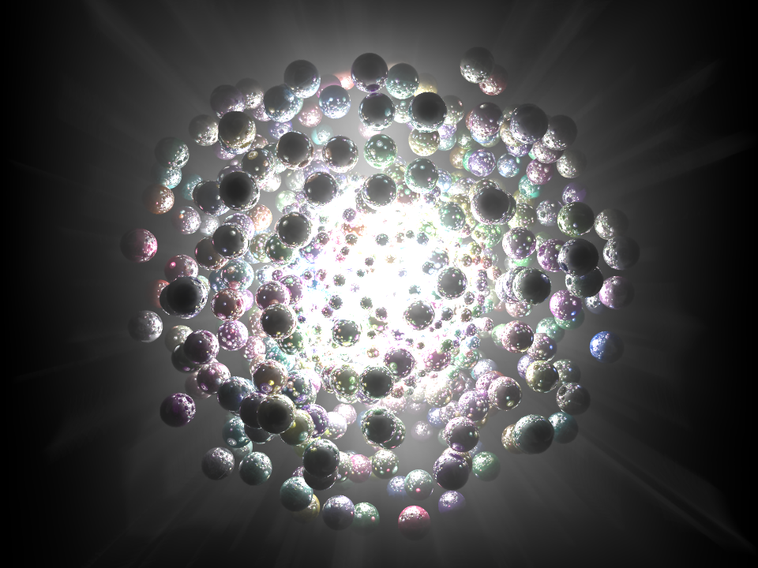

Not visually pleasing but I wanted to see how to render rays of light in POV-Ray. There two things you need: a box/container for the whole scene with media/scattering, and to render with photon mapping. The scene was made using a Kotlin script builder similar to: [POV-Ray Kotlin script blobgen](POV-Ray%20Kotlin%20script%20blobgen.md)

```
#declare rad = on;
#declare hqRad = on;

global_settings {
	#if(rad)
	radiosity {
		#if(hqRad)
		pretrace_start 0.08
				pretrace_end   0.01
				count 500

				nearest_count 10
				error_bound 0.02
				recursion_limit 1

				low_error_factor 0.2
				gray_threshold 0.0
				minimum_reuse 0.015
				brightness 1

				 adc_bailout 0.01/2
				#end
	}
	#end
	
	photons {
		count 2000
		media 100
	}
}
	
camera {
	location <0.0, 0.0, -25.0>
	look_at <0.0, 0.0, 0.0>
}

light_source { 
	<0.0, 0.0, 0.0> rgb <1.0, 1.0, 1.0>
	looks_like {
		sphere {
			<0,0,0>, 2
			texture{
				pigment {color rgb <1, 1, 1>}
				finish {
					ambient 1 diffuse 5
					emission 2
				}
			}
		}
	}
}

background {color rgb <0.0, 0.0, 0.0>}

box { <-10, -10, -10>, <10, 10, 10>
	pigment { rgbt 1 } 
	hollow
	interior { 
		media { 
			scattering { 0.5, 0.005 extinction 0.8 }
			samples 30
		}
	}
}

//Spheres
sphere {
	<-8.634976, 4.4759254, -1.8721784>, 0.6
	texture{
		pigment {color rgb <0.30298874, 0.8694627, 0.8612276>}
		finish {
			ambient 0.075
			diffuse 0.9
			reflection 0.9
		}
	}
	photons { 
		target reflection on 
	}
}

// ... thousands of spheres here
	
sphere {
		<-0.36827052, -3.8570876, -3.129366>, 0.2
		texture{
			pigment {color rgb <0.30298874, 0.8694627, 0.8612276>}
			finish {
				ambient 0.075
				diffuse 0.9
				reflection 0.9
			}
		}
		photons { 
			target reflection on 
		}
	}
```