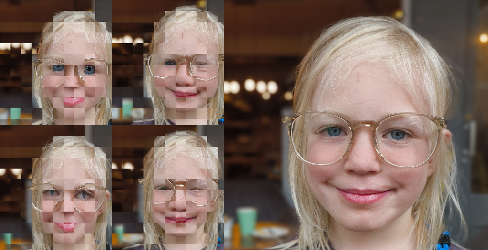
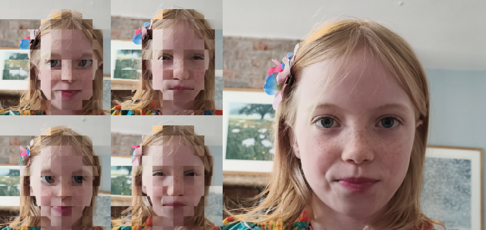
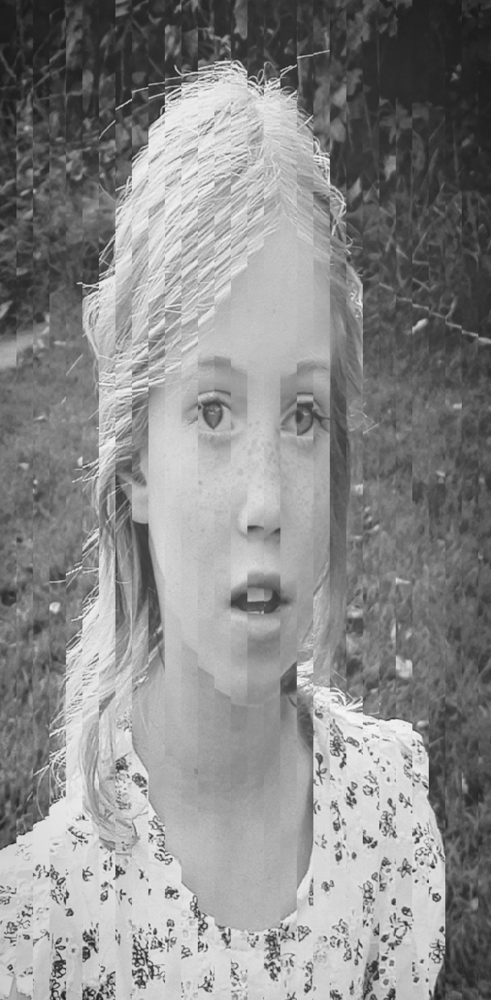
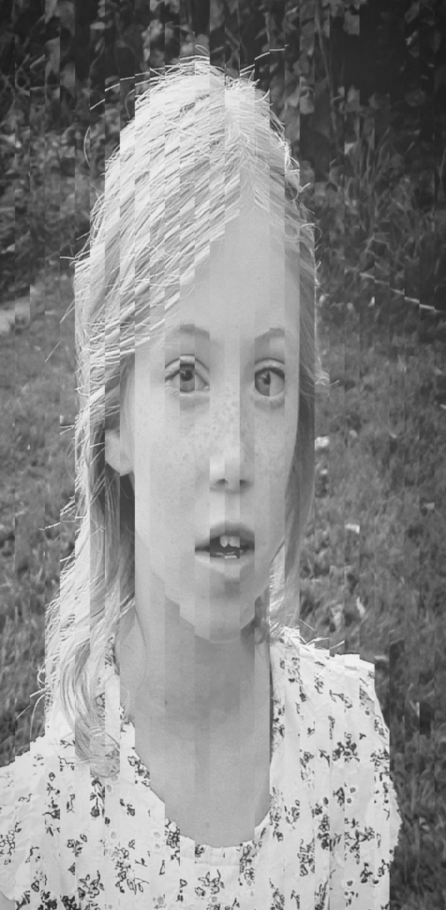
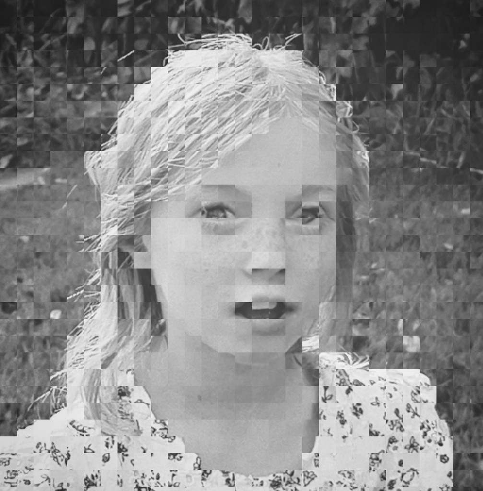
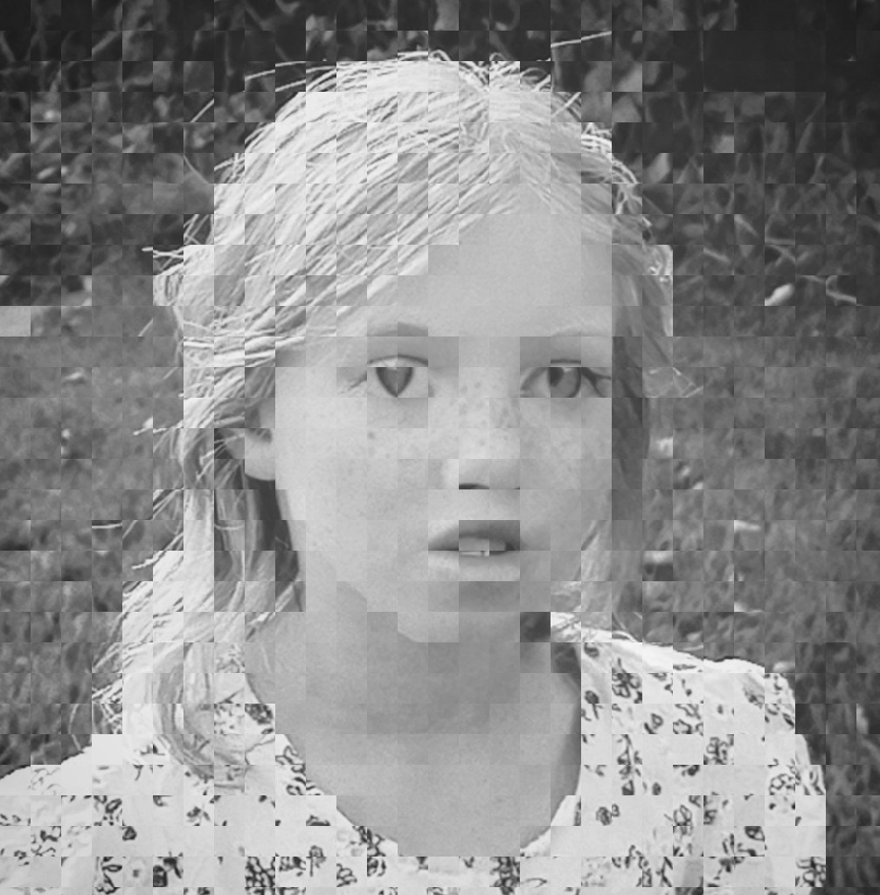
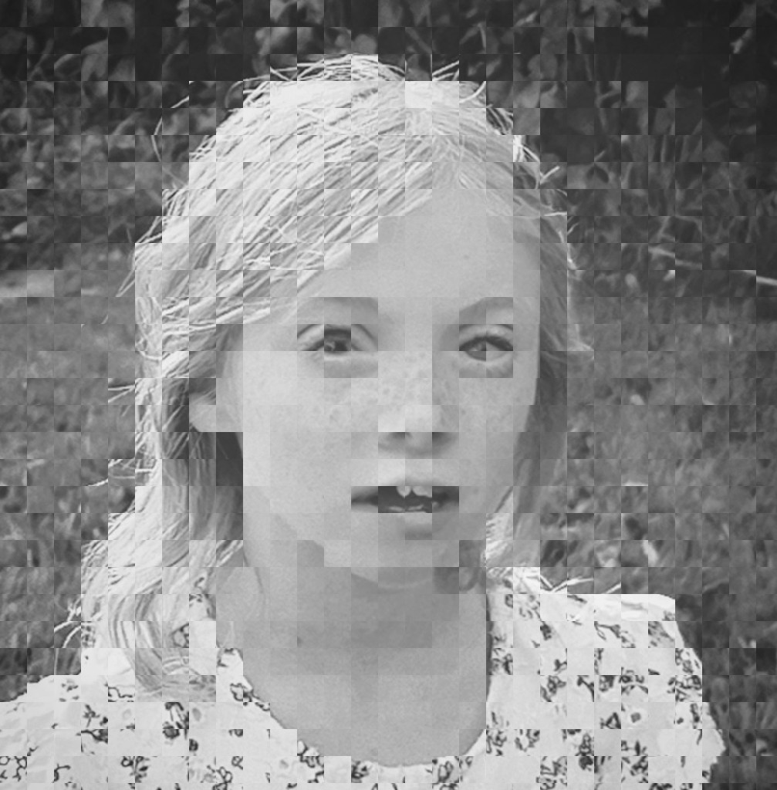
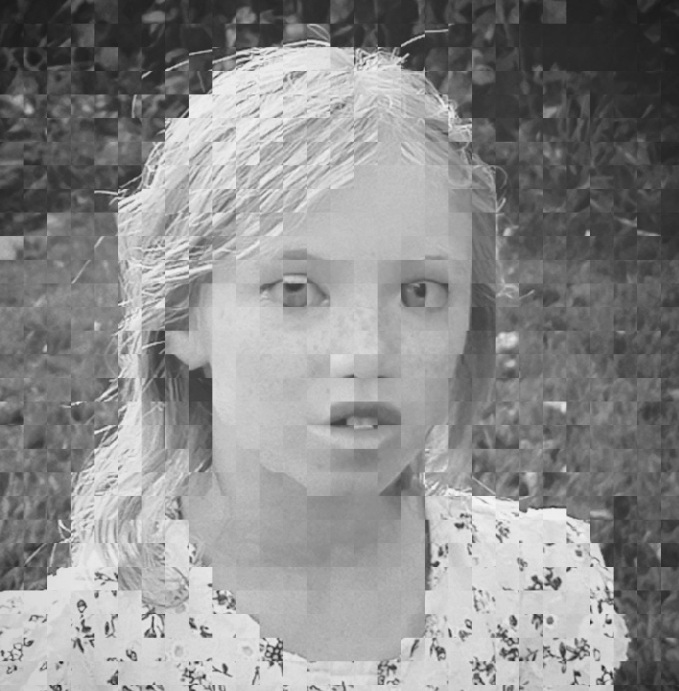
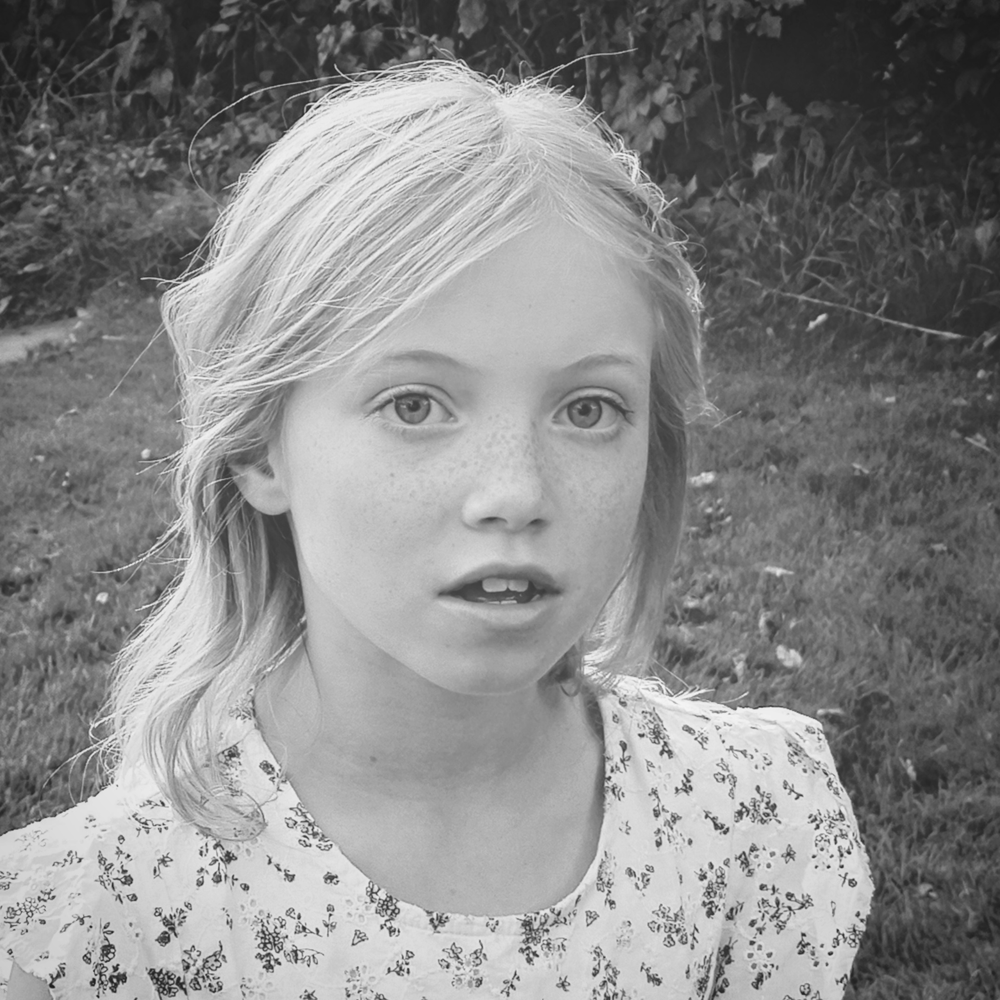

A quick sketch in [Processing](https://processing.org). Firstly it slices a source image into vertical strips, then reassembles those into two new images, same height, but half width, alternating slices. That process is then repeated on the two vertical images but sliced horizontally - this results in four images with the same aspect ratio as the source, but sharing no pixels with each other.



| Vertical slice A         | Vertical slice B         |
| ------------------------ | ------------------------ |
|  |  |

|  |  |
| ------------------------ | ------------------------ |
|  |  |


```
PImage source;

PImage imageA;
PImage imageB;
PImage imageC;
PImage imageD;

int slices = 60;

void setup() {
  size(1200, 800);
  source = loadImage("a2.jpg");

  ImagePair halfWidth = shredVertical(source);
  
  ImagePair halfHeightA = shredHorizontal(halfWidth.first());
  ImagePair halfHeightB = shredHorizontal(halfWidth.second());
  
  imageA = halfHeightA.first();
  imageB = halfHeightA.second();
  
  imageC = halfHeightB.first();
  imageD = halfHeightB.second();
  
  //halfWidth.first().save("firstA.jpg");
  //halfWidth.second().save("firstB.jpg");
  //imageA.save("imageA.jpg");
  //imageB.save("imageB.jpg");
  //imageC.save("imageC.jpg");
  //imageD.save("imageD.jpg");
}

ImagePair shredHorizontal(PImage source){
  
  int spliceDiameter = source.height/slices;
  
  PImage splicedA = createImage(source.width - spliceDiameter, source.height/2 - spliceDiameter, RGB);
  PImage splicedB = createImage(source.width - spliceDiameter, source.height/2 - spliceDiameter, RGB);
  
  
  
  for(int i = 0 ; i < slices ; i++){
    PImage slice = source.get(0, i * spliceDiameter, source.width, spliceDiameter);
    if(i % 2 == 0){
      splicedA.set(0, (i/2) * spliceDiameter, slice);
    }else{
      splicedB.set(0, (i/2) * spliceDiameter, slice);
    }
  }
    
  return new ImagePair(splicedA, splicedB);
}

ImagePair shredVertical(PImage source){
  
  int spliceDiameter = source.width/slices;
  
  PImage splicedA = createImage(source.width/2 - spliceDiameter, source.height - spliceDiameter, RGB);
  PImage splicedB = createImage(source.width/2 - spliceDiameter, source.height - spliceDiameter, RGB);
  
  for(int i = 0 ; i < slices ; i++){
    PImage slice = source.get(i * spliceDiameter, 0, spliceDiameter, source.height);
    if(i % 2 == 0){
      splicedA.set((i/2) * spliceDiameter, 0, slice);
    }else{
      splicedB.set((i/2) * spliceDiameter, 0, slice);
    }
  }
    
  return new ImagePair(splicedA, splicedB);
}

void draw() {
  image(imageA, 0, 0, imageA.width/2, imageA.height/2);
  image(imageB, imageA.width/2, 0, imageB.width/2, imageB.height/2);
  image(imageC, 0, imageA.height/2, imageC.width/2, imageC.height/2);
  image(imageD, imageC.width/2, imageA.height/2, imageD.width/2, imageD.height/2);
  
  image(source, imageA.width-1, 0, source.width/2, source.height/2);
}

class ImagePair {

    private final PImage elementA;
    private final PImage elementB;

    public ImagePair(PImage elementA, PImage elementB) {
        this.elementA = elementA;
        this.elementB = elementB;
    }

    public PImage first() {
        return elementA;
    }

    public PImage second() {
        return elementB;
    }
}

```


<small>Source image</small>