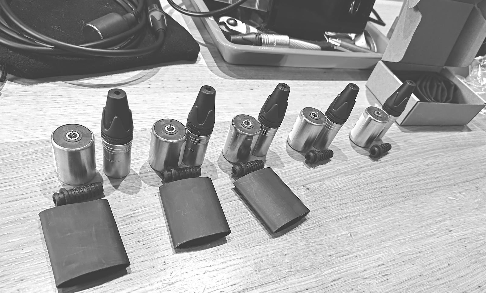

You can buy an assembled _Orllewin geophone_ directly: [Shop: Orllewin geophone](../shop/Orllewin%20geophone.md).

## Materials

* 14Hz omnidirectional seismic sensor.
* 1" Inner Diameter 3:1 heat shrink tubing with adhesive lining.
* High quality audio cable (eg. Mogami 2534)
* Male XLR connector (eg. Neutrik), or 1/4" or 3.5mm mini jack.