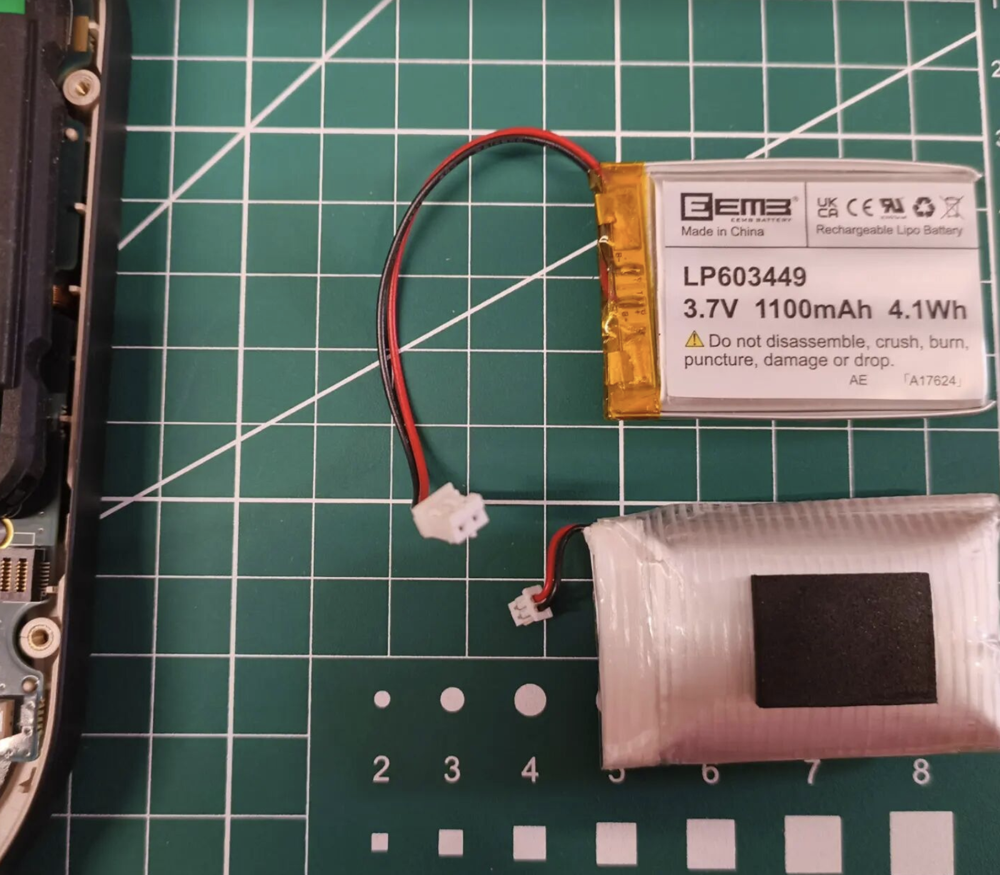
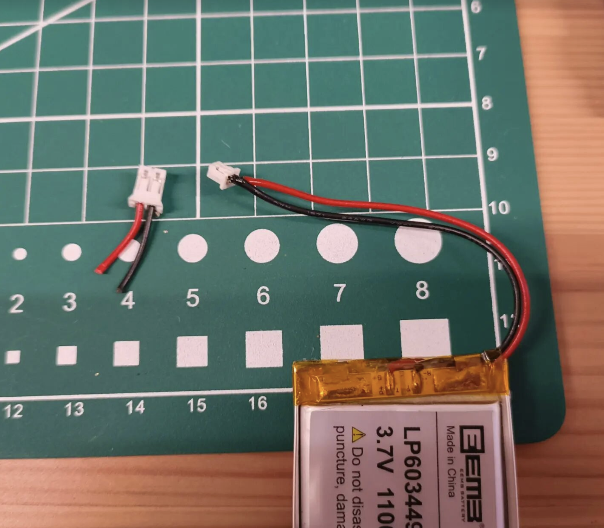
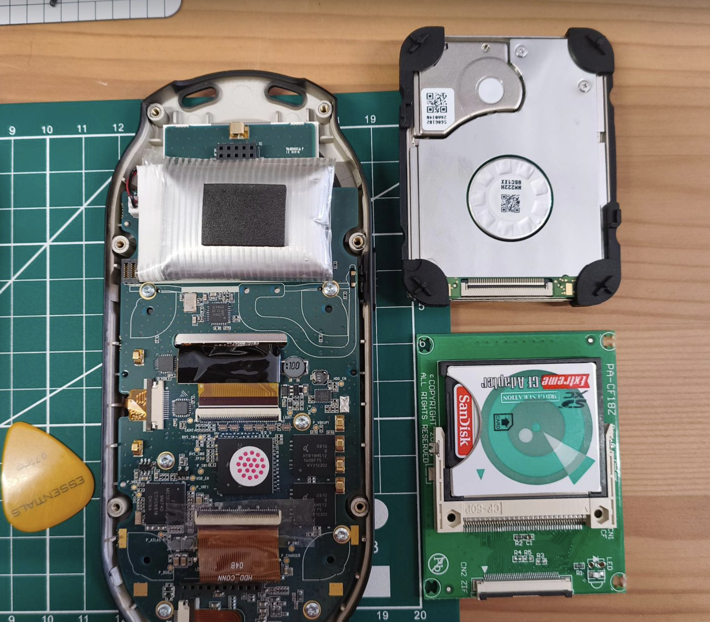
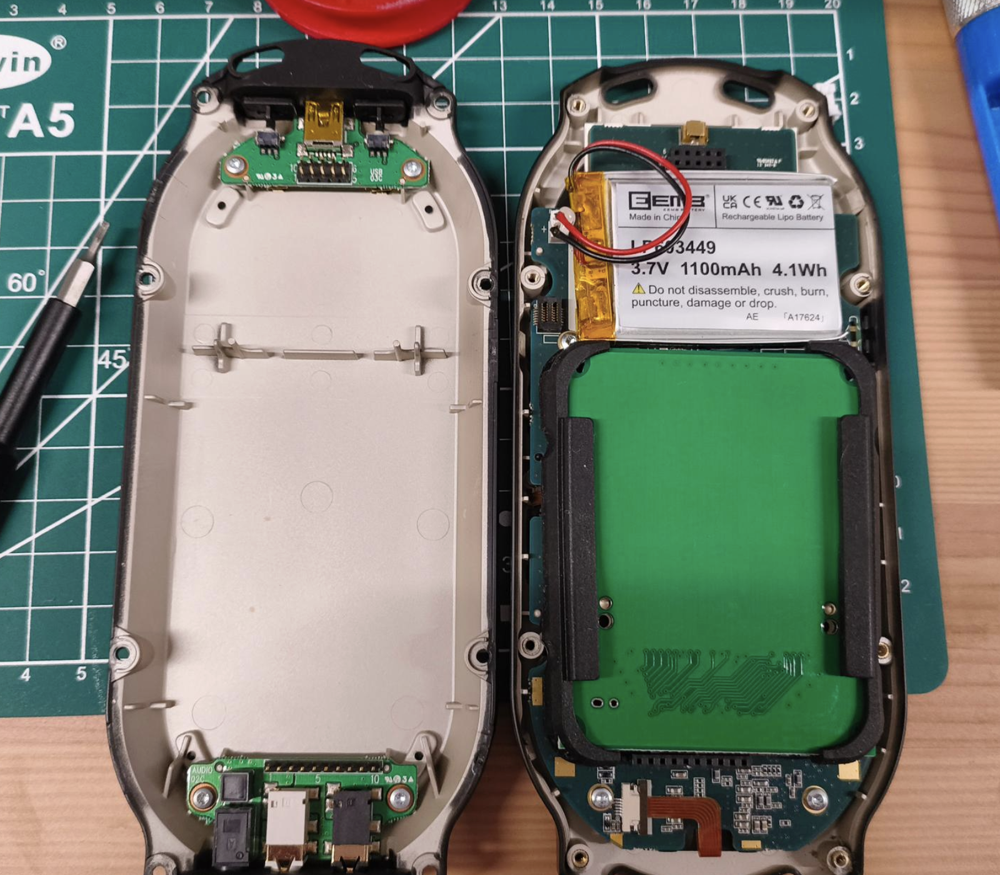
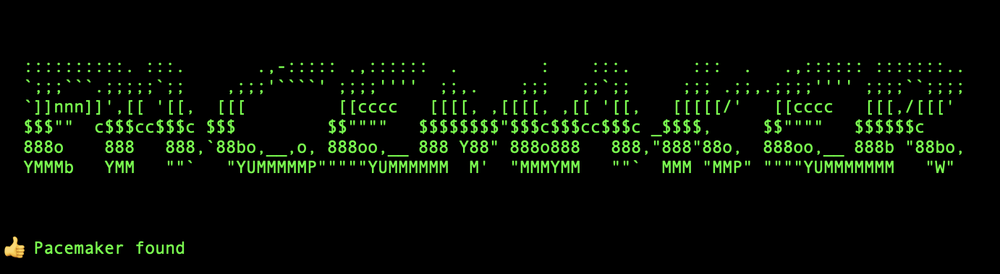

The Tonium Pacemaker was an early mobile DJ tool, years ahead of its time. I never bought one, they were too expensive, and they had a mechanical hard disk which made them fragile. Times change, you can now replace the hard disks with an SD card via a caddy/adapter, and I've written a [command-line tool to manage the device from Mac OS](https://github.com/orllewin/pacemaker) as the 1st party software won't run on modern Macs.

---
## Dead battery resurrection

I bought a unit from eBay that had been sat unused in a drawer for years. It arrived and boot-looped when plugged in to power via USB. I ordered a 5v 2 amp PSU with interchangeable plugs, after charging overnight the battery is charged and the unit works. The female DC barrel socket is around 3mm.

<iframe width="405" height="720" src="https://www.youtube.com/embed/W1MwVPL9V_c" title="Poorly Pacemaker." frameborder="0" allow="accelerometer; autoplay; clipboard-write; encrypted-media; gyroscope; picture-in-picture; web-share" referrerpolicy="strict-origin-when-cross-origin" allowfullscreen></iframe>

The batteries in these old units are showing their age, as well as not holding a charge for as long as they should they're bloated and dangerous. I replaced the original battery with a new 1100mAh 3.7v LiPo battery. The connector was larger than the Pacemaker, so I reused the one from the original battery, snipping and tinning the wires from the new battery and pushing the end snugly into the connector:

| New and old battery           | Connector differences         |
| ----------------------------- | ----------------------------- |
|  |  |

---
## Solid state conversion

The Pacemaker came with either a 60 or 120Gb Samsung hard disk, a mechanical hard disk with a read/write head, which shows how old it is (at least in the world of tech). I replaced this disk with a 32Gb SD card, sat in a Compact Flash adapter, in turn held in a ZIF to Compact Flash adapter (tip of the hat to [cubicgarden.com](https://cubicgarden.com/)).  The trickiest part of this operation was working with the short and fragile ZIF ribbon cable (dark brown to the bottom of the photo below), wiggling it into place in the CF to ZIF adapter until it felt aligned either side then clipping into place, a guitar plectrum helped in place of clumsy finger nails and I reused the rubber padding from the old hard disk for the ZIF/CF adapter board:

| New and old storage                 | New solid state storage in place    |
| ----------------------------------- | ----------------------------------- |
|  |  |

---
### Kotlin script

Project details on Github: [Pacemaker](https://github.com/orllewin/pacemaker) - the Pacemaker Kotlin script can initialise a device and install firmware, and write MP3 details to the Pacemaker database and copy the files over. It keeps the Pacemaker usable on a modern macOS computer without having to run Windows 11 in [Parallels](https://www.parallels.com/) (which admittedly does work really well even on an early 8Gb ram M1 Macbook Air, install takes 5 minutes and it automatically installs Windows 11 ready for use, with seamless integration with macOS).

The script will extract `TBPM` tags from MP3s but it doesn't carry out the more advanced beat-locking/timestamp features that the old 1st Pacemaker Edit software did, this means you can still beat-match seamlessly, but you will need to do a little manual work. Reverse-engineering the beat timestamp format that the original software had might be too tricky.