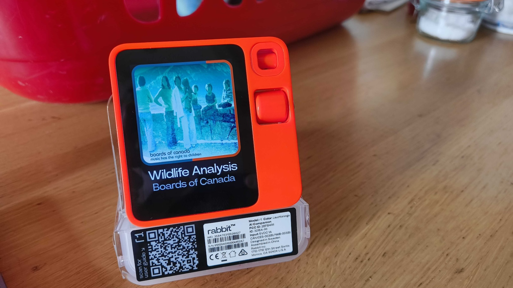

I've got my hands on a [Rabbit R1](https://www.rabbit.tech/), not for the ai, but to hack the hardware. Unfortunately after the initial batch which shipped with a useful accidental backdoor to get ADB enabled (connect a USB keyboard and use simple key combination to open the notification drawer) all subsequent batches shipped with updated firmware which are more locked down.

Good progress is being made by some talented devs hacking the Rabbit which should eventually be fully jailbroken, for now though my unit will stay largely unused because these LLM based services use an incredible amount of energy to operate.

## Links

* https://rabbitu.de/
* https://firmburrow.rabbitu.de
* https://firmburrow.rabbitu.de/rabbitude/dumps
* https://x.com/xyz3va

## Rabbit inc.

This CEO is ridiculous.

