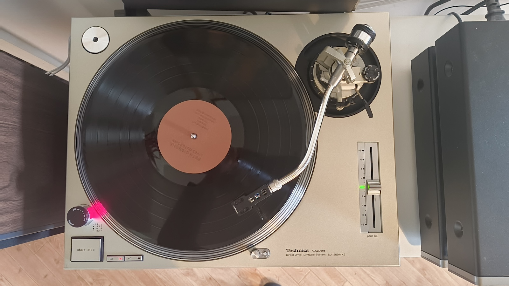
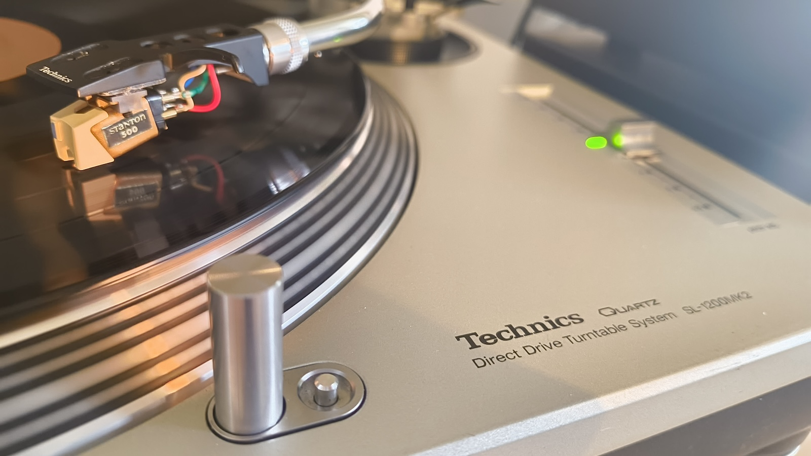

I've now got a Technics 1200, manufactured in August 2004.  I'll document any upgrades or 
mods here.

## Cartridge

It came with a Stanton 500, a classic budget cartridge, which was what everyone used in bars and clubs before the Ortofon OM and Concorde seemed to take over.