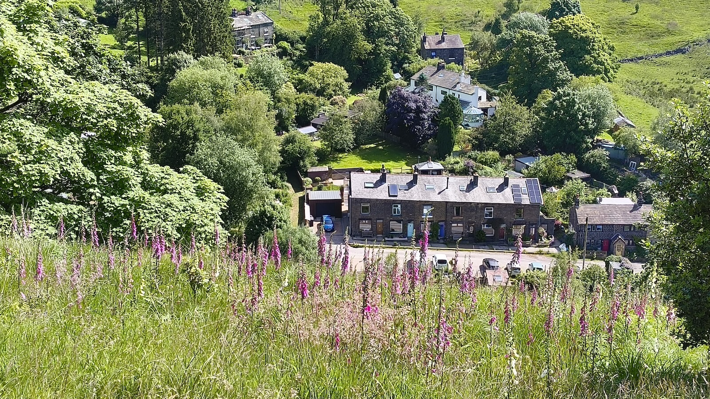

|  |  |
| ------------------------------- | -------------------------------- |
|  |   |
We moved to Cliff View, on Pudsey Road, Pudsey Clough in June 2024. The end terrace on a row of 6. Bottom two photos above taken from the cliff, of 'Cliff View'.

Although it looks older, this photo is from 1985, the Cliff View row of houses are visible to the right of the chimney stack. The more modern red brick house on the far right offers a useful visual anchor, with the sharp bend to Shore Road/Pudding Lane. From [Pennine Horizons](https://penninehorizons.org/items/show/7756)

A modern OpenStreetMap above, with our house circled in red. Below, the 1938 1:25000 map, the area seems to have escaped the surveyors entirely:

A very detailed 1928 map doesn't show the row of houses either, though they were here then, so this must have been copied from an earlier map without survey:

A beautifully detailed 1909 map showing no houses at the same latitude as Pitts:

There's no wealth of information about the new house like there was for [Sourhall](Sourhall.md). There is some information about who lived here in 1911 from research of the [Crowther family line](https://www.20cdiary.com/crowther-line.php) which includes photographs of two people, Rachel Crowther and son, James Pickles, so the house was here in 1911 and it's absence from maps shows the area hadn't been surveyed.

| Rachel Crowther                            | James Pickles                              |
| ------------------------------------------ | ------------------------------------------ |
|  |  |

From [Pennine Horizons](https://penninehorizons.org/items/show/24953)

## Coal Clough Wind Farm

Fifteen minutes walk up the clough is Coal Clough Wind Farm where I recorded a turbine with my [Orllewin geophone](../../shop/Orllewin%20geophone.md) for a short-run tape release: [EBCT001](EBCT001).
## Links

[Landscape Story, Custodianship](https://landscapestory.co.uk/2023/10/19/custodianship/)