Tackling sections of the Pennine Way ~33 years after I started. I tried to arrange a sabbatical from an old job to do this around 2016, but my manager said "next year".  After a job change or two, then a daughter arriving, then a son, it's only now I can start to find time here and there to tackle it in sections. 
## Circa 1991 Edale to Hadfield

As a teenager, headed to Didsbury train station to meet school friend JP, then a change at Manchester Piccadilly to Edale where we headed off on the Pennine Way. I can't remember what our plans were but we had sleeping bags and a cooking stove (my sleeping bag was an army surplus, I remember it was very heavy, maybe we planned to stay in a YHA). I hit a wall at some point due to not having any breakfast so we camped in a cave JP knew about that was popular as a shelter with climbers. The midges were out in force but we found burning meths kept them away so we kept the stove (possibly a Trangia) burning when the bites woke us up overnight. The next morning we dropped down by the reservoirs to Hadfield to get the train home.

## 28 03 2025 Colden to Haworth

S dropped me off at Colden after the morning school run, just next to 'May's Shop' which is a famous stop on the Pennine Way for people to get supplies. 

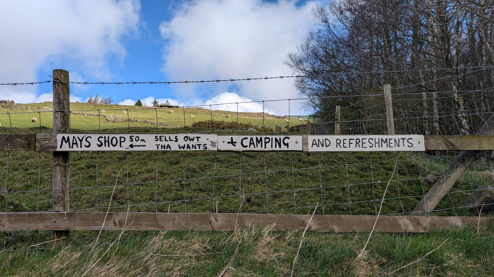
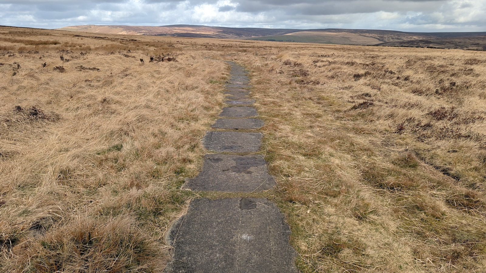

My legs were fresh so it was all fairly easy going. I had a brief stop at an old stone pack horse bridge (a pub close-by is called the Pack Horse) then took a slight detour along the west side of Walshaw Dean Reservoir to check out the remnants of an old stone circle I'd visited previously ([Walshaw Dean Reservoir Circle](../stones/west_yorkshire/Walshaw%20Dean%20Reservoir%20Circle.md)). 

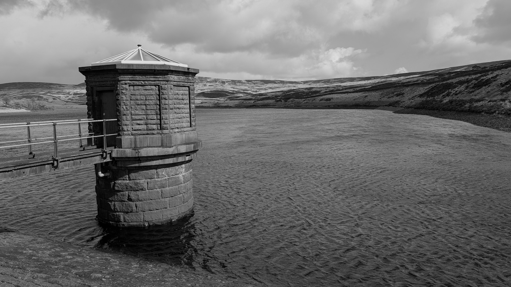
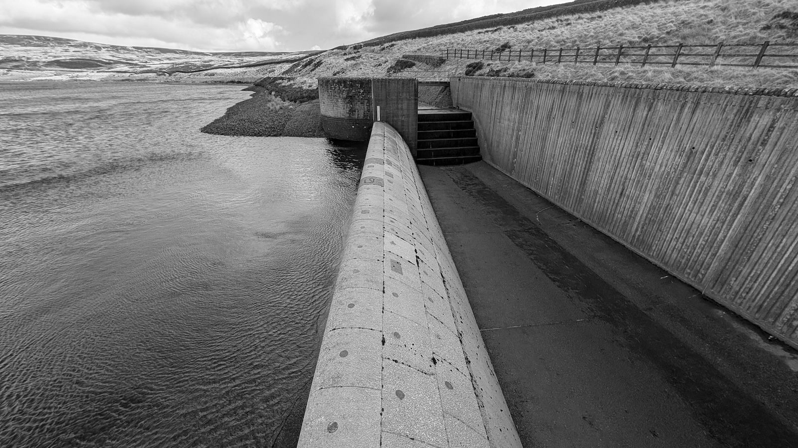

Once over Top Withins it was an easy descent towards Haworth via the Brontë waterfalls (little more than a brook) and along the Brontë Way. A bemused walking couple asked me if I knew what Arashi Ga Oka meant, I didn't, but it's a 1988 Japanese film adaption of Wuthering Heights:

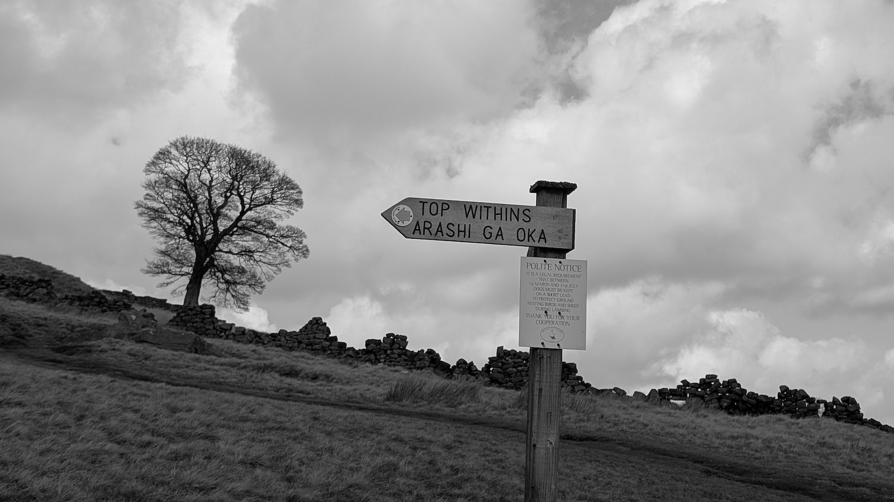

It was at this point I realised Haworth YHA was almost 4 miles from the Pennine Way and I'd made a slight strategic error. Before arriving at Haworth I spotted a trig point on the map above town on Penistone Hill, so I bagged that before having a pint in the Cloth Store bar on Main St. 

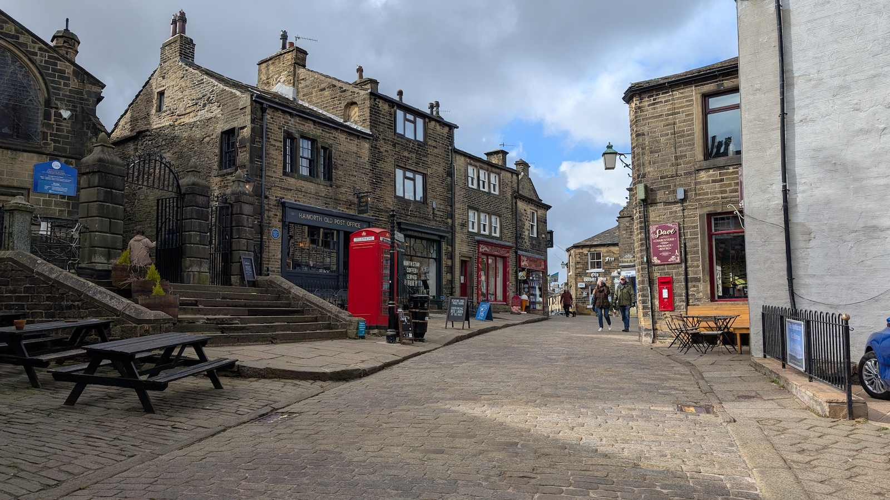

Haworth YHA is another mile or so from this central area down a suburban street, after checking in and with tired legs I settled for a chippy tea eaten at a bus shelter before turning in for an early night.

* [Wuthering Heights: Arashi ga oka | 嵐が丘](https://mubi.com/en/gb/films/wuthering-heights-1988)
* [May's Shop](https://www.examinerlive.co.uk/news/west-yorkshire-news/yorkshire-woman-whos-run-shop-22779908)

## 29 03 2025 Haworth to Earby

I left the YHA and headed to the Buffet Car cafe for breakfast which I'd been to recently to meet some old friends, there's a Spar next door so I got some supplies for the day. I'd been contemplating getting a taxi back to the Pennine Way but that felt like it'd be cheating so I headed back up Main St. and then followed the road along the north side of Lower Laithe Reservoir before meeting the Pennine Way again at Ponden. 

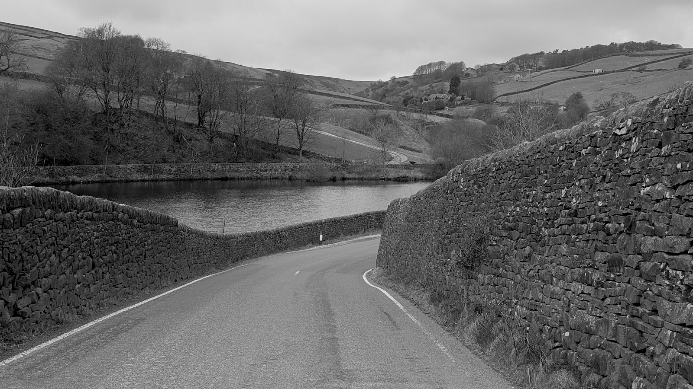
<small>Ponden reservoir, where I rejoined the Pennine Way outside Haworth</small>

A small field climb and short road section later I was on the moors again and visited Old Bess, a 4ft recumbent stone that looks slightly dubious to me (it appears to just be a standard old masoned gate post), and then on to the trig point at Little Wolf Stones:

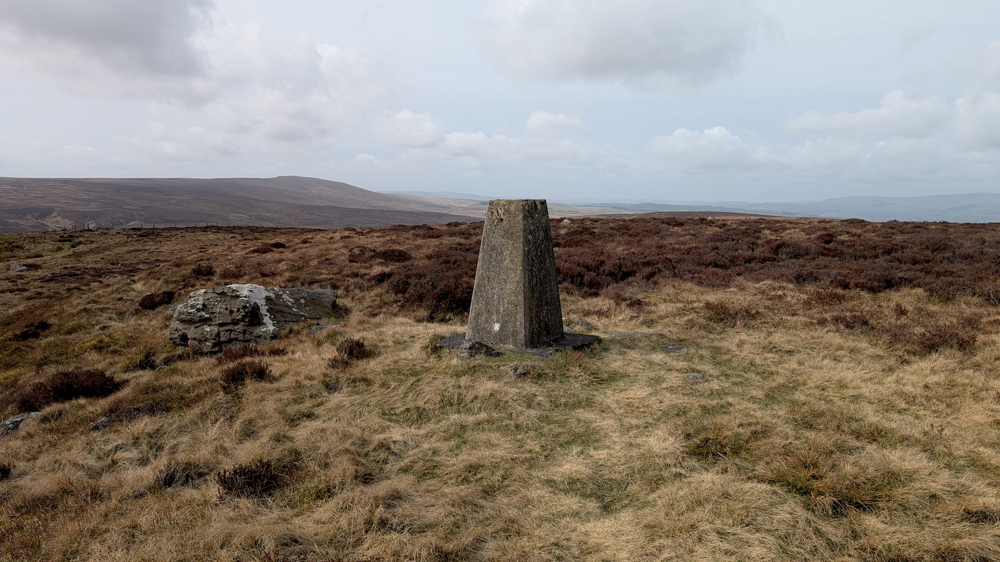

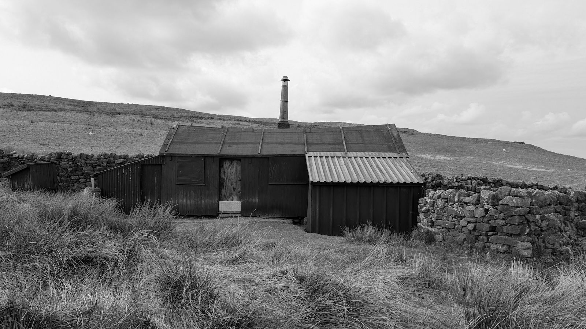
<small>Sadly this is a shooting hut, not a bothy</small>

After heading down to Cowling there was a long section of incredibly tedious farmland hill walking (more ascent than descent), things improved at the top over Elsack/Oakworth Moor where I took a small detour to Robert Wilson's Grave, a stone with inscription at the spot where the beacon guard's body was found. 

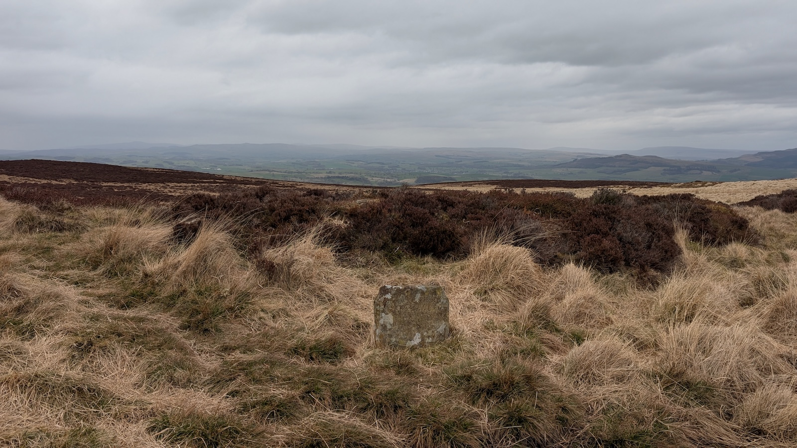

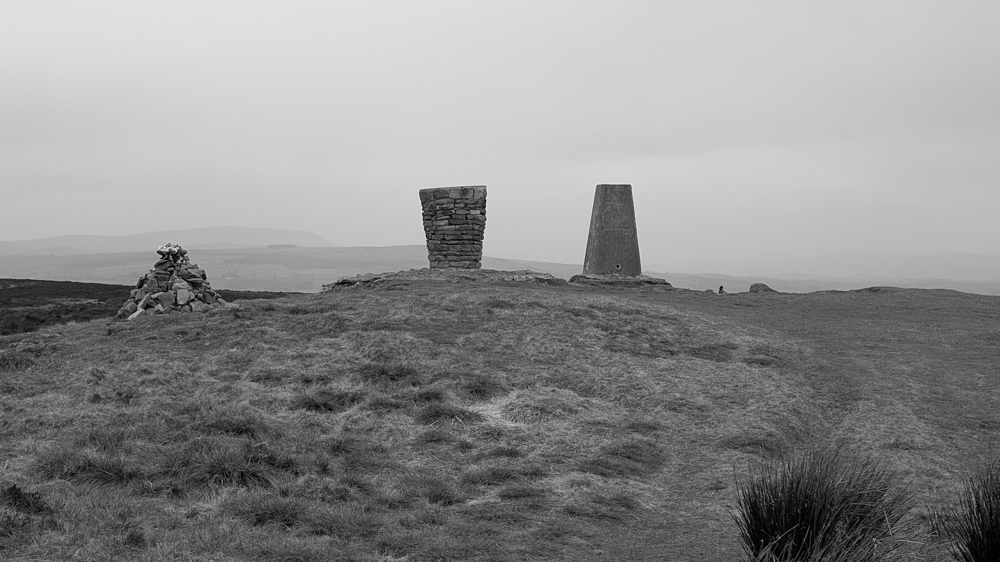
<small>Trig points should not be accompanied by more furniture!</small>

A second trig point followed before a long moorland descent towards Thornton-in-Craven and a final stretch of boring sheep pasture to Booth House where I had a room booked. Booth House is luxurious but a fair walk from any amenities, thankfully the owner offered to drive me to a local pub (The Punchbowl) where I got a big meal before getting an early night. 

* [Old Bess Stone (Oakworth Moor)](https://www.megalithic.co.uk/article.php?sid=48180)
* [The Beacon Guard's Grave](https://www.andrewgrantham.co.uk/thegranthams/paul/graves/beaconguard.html)
## 30 03 2025 Earby to Malham

An easier day, or it would be if my legs weren't so tired, the Pennine Way here has a section of easy canal walking, I decided to stick with the canal path instead of cutting across country towards Gargrave, I'd had enough of walking on farmland (I'd rather walk ancient lanes and byways than sections on pasture): 

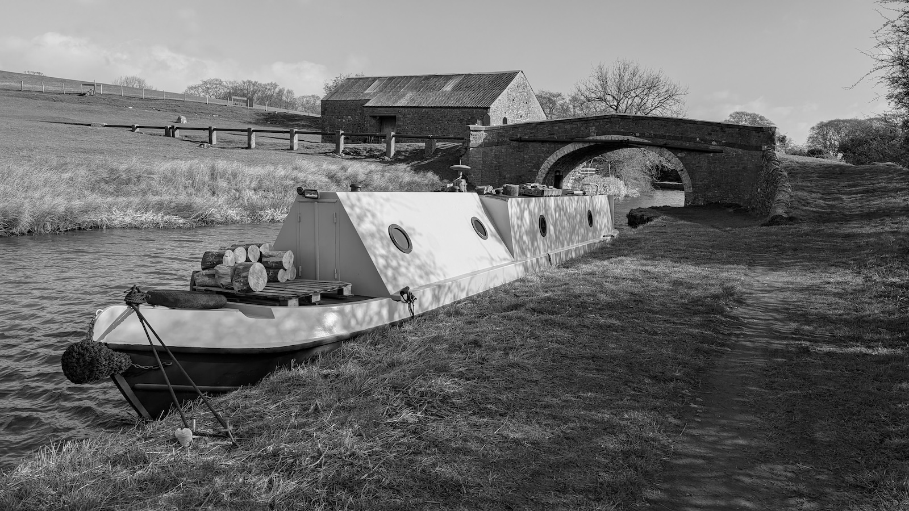
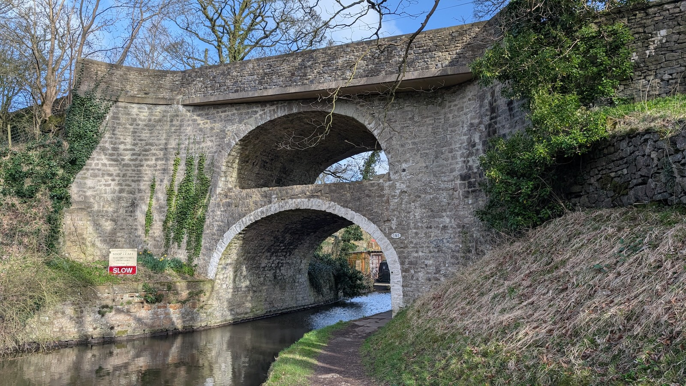
<small>East Marton canal bridge. The second tier was built to accommodate the A59</small>

At Gargrave there are public toilets and a nice cafe called The Dalesman for a quick bite to eat before heading towards Malham. A small easy climb with a slight detour to Haw Crag trig point, it's here the landscape changes to limestone crags and a glimpse of the better scenery ahead before descending towards Airton and Malham. I was looking forward to what looked like an easy few miles along the River Aire, but my legs and back were really feeling the effects after 3 days and it was a bit of a slog. One last very steep but short climb up Badger Hill and you get to Malham where my family were waiting for me. We had a quick rest and an ice cream before walking to Malham Cove. S and A climbed the stone steps above the cove while me and P had a slow walk/hobble back to the car.

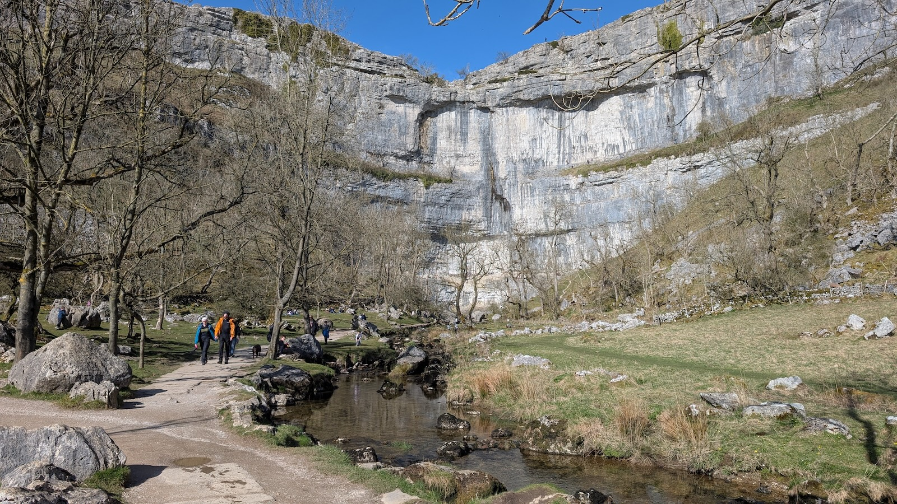

