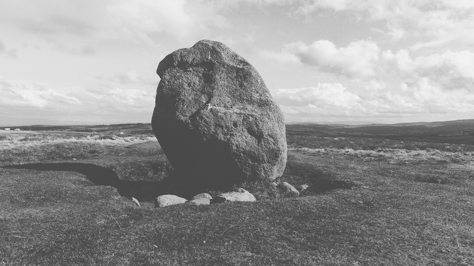
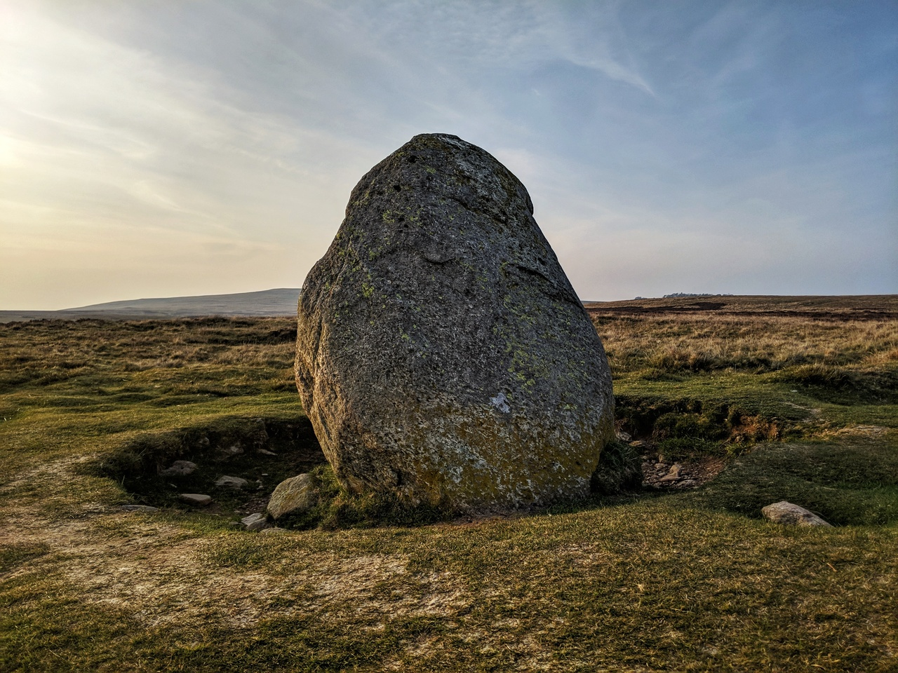
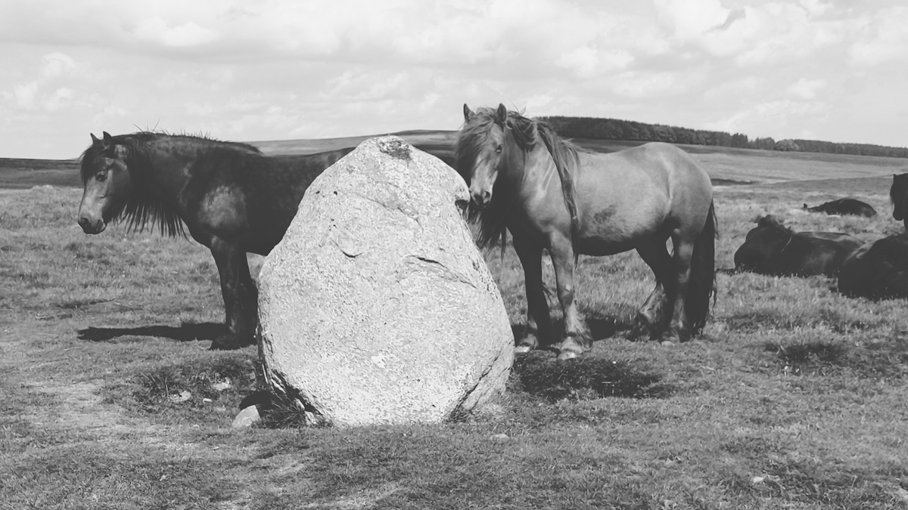

Askham Fell/Moor Divock, Cumbria


<small>March 29th 2024</small>


<small>Original photo from April 20th 2019</small>

[OS Grid Ref: NY 49561 21634](https://explore.osmaps.com/pin?lat=54.587639&lon=-2.785505&zoom=15.5721)

```

Geo URI: geo:54.5873,-2.7820
Latitude: 54° 35' 14" N
Longitude: 2° 46' 55" W
```

A glacial erratic (or is it?). Our dog Molly has her ashes scattered here (generally frowned-upon in the lakes but my wife grew up on this fell so we claim locals-rights!)


<small>Fell ponies, 25th May 2024</small>
