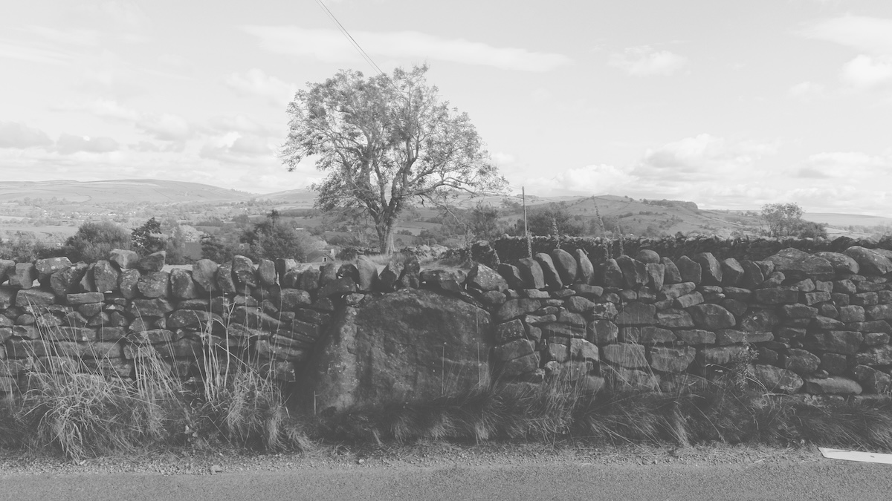
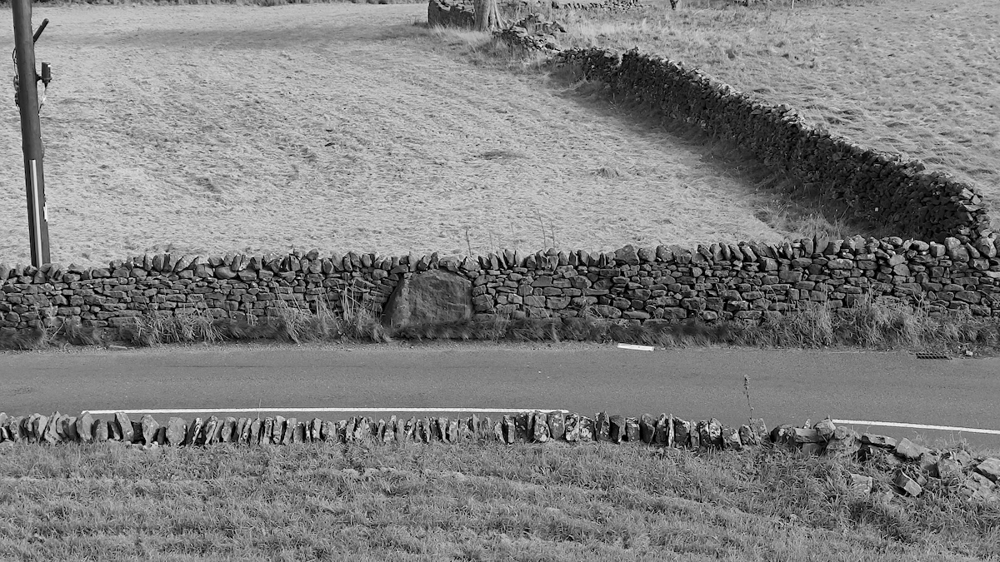
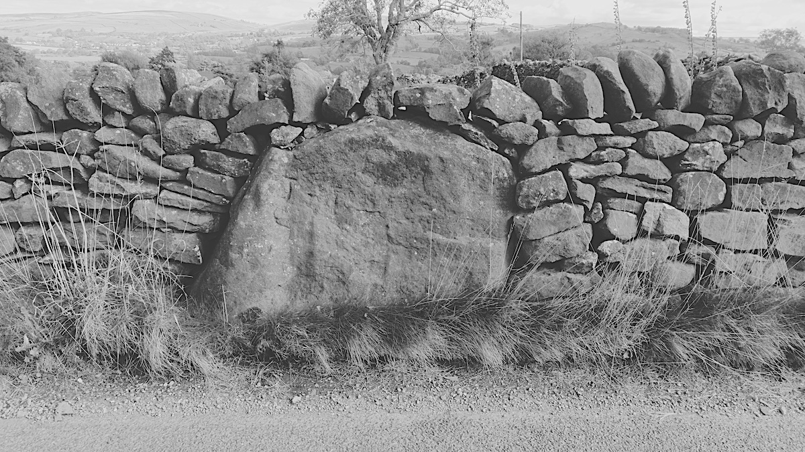

[Foulridge](https://en.wikipedia.org/wiki/Foulridge), Burnley

Visited: 28th September 2024



### 53.88455° N, 2.18365° W

[Ordnance Survey Pin](https://explore.osmaps.com/pin?lat=53.884537&lon=-2.183645&zoom=16.9956&style=Standard&type=2d)

```
OS Grid RefSD: 88025 43166
Longitude: 2°11'1"W
Latitude: 53°53'4"N
```






