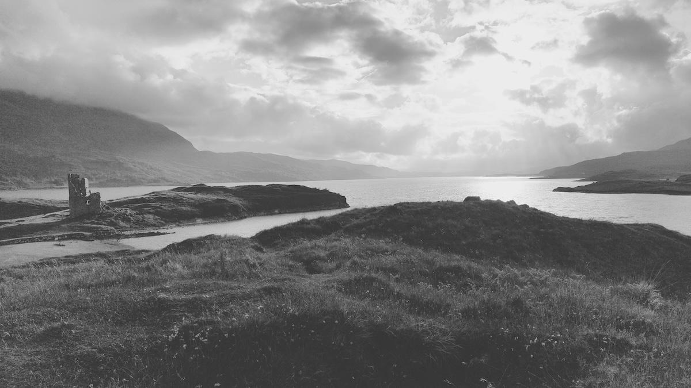
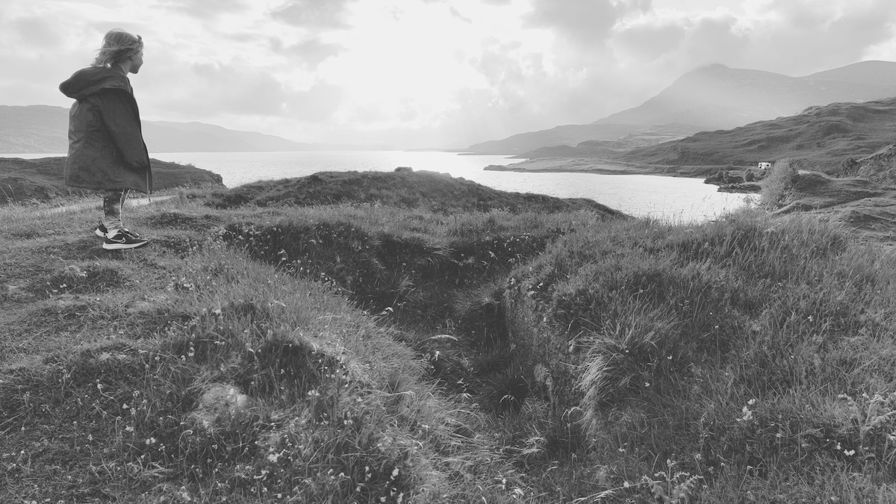
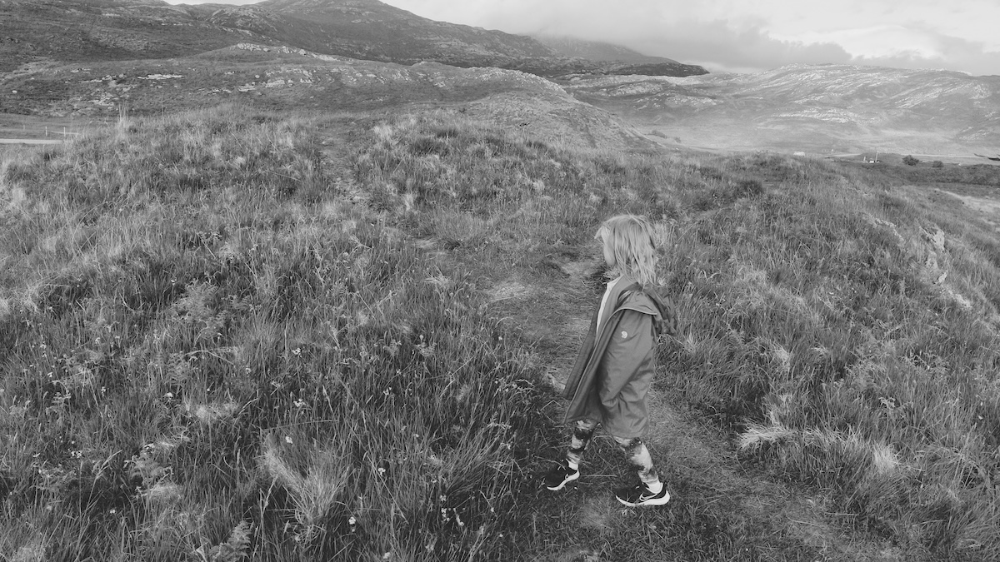

Date visited: 29th May 2024

Chambered cairn on a hillock next to Ardvreck Castle.



### 58.167070, -4.991382

[Ordnance Survey Pin](https://explore.osmaps.com/pin?lat=58.167070&lon=-4.991382&zoom=15.0000&style=Leisure&type=2d)

```
OS Grid Ref: NC 24135 23704
Latitude: 58°10'1"N
Longitude: 4°59'29"W
```


## Links
* [megalithic.co.uk](https://www.megalithic.co.uk/article.php?sid=27036)

