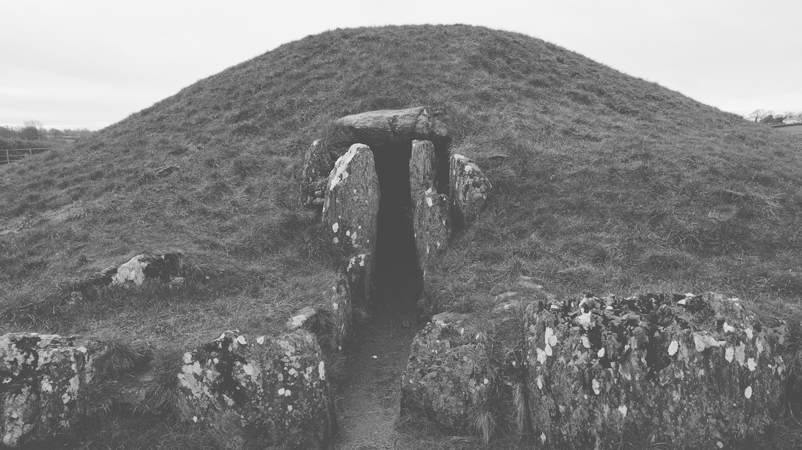
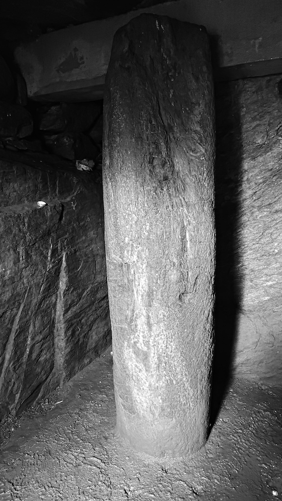
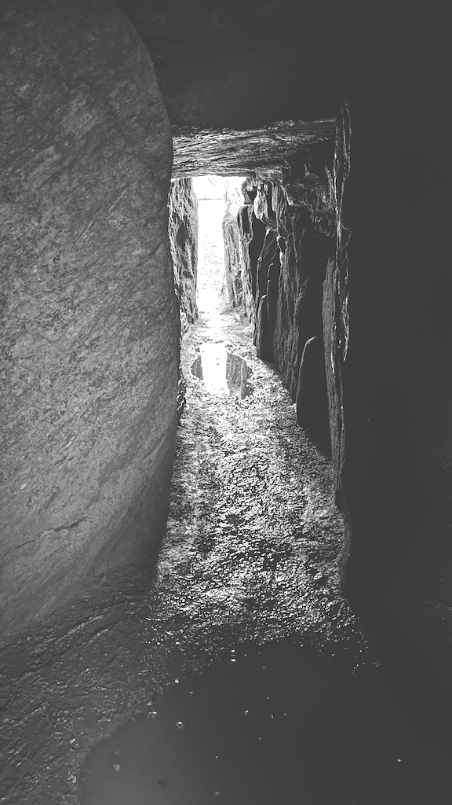
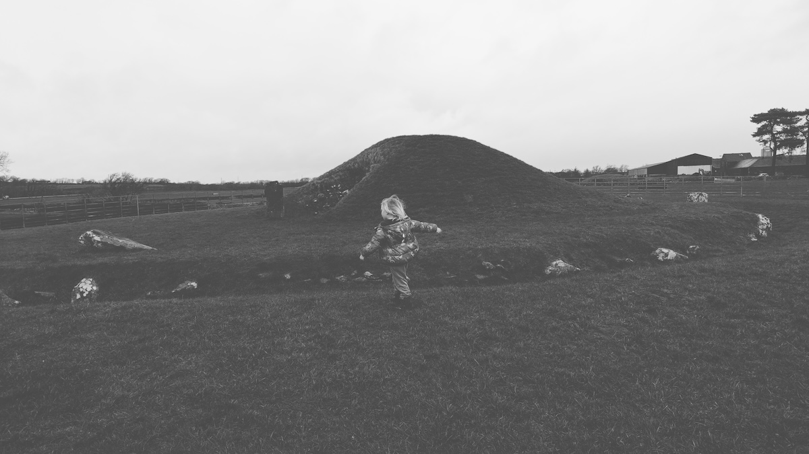

Visited: 16th Feb 2024



## 53.20786, -4.23610

[Ordnance Survey Pin](https://explore.osmaps.com/pin?lat=53.207742&lon=-4.236176&zoom=15.0000&style=Leisure&type=2d)

```
OS Grid Ref: SH 50754 70187
Latitude: 53°12'28"N
Longitude: 4°14'10"W
```

| Internal stone                                     | Looking back out                                   |
| -------------------------------------------------- | -------------------------------------------------- |
|  |  |


