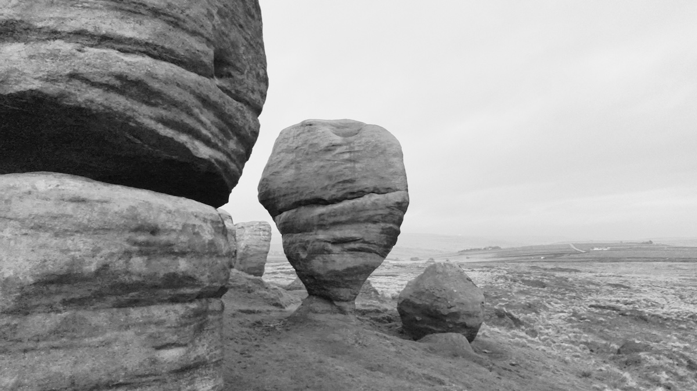
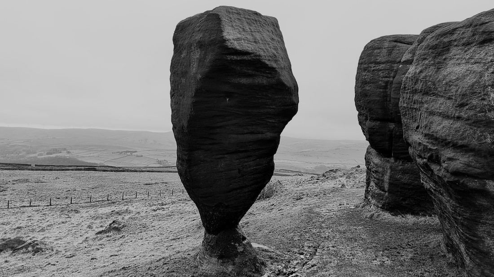
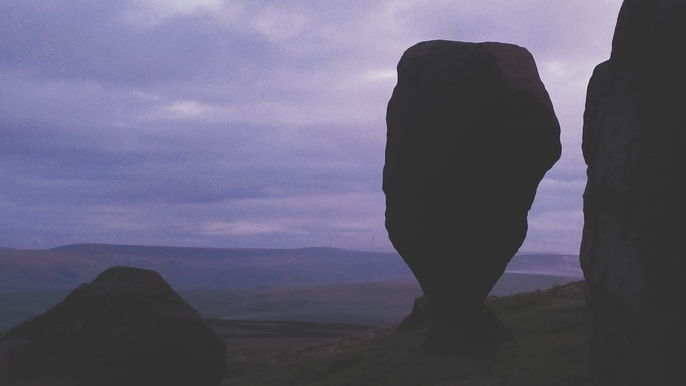

**Todmorden, West Yorkshire**


<small>22nd April 2024</small>



First posted: 12th December 2021

[OS Grid Ref: SD 93091 26732](https://osmaps.ordnancesurvey.co.uk/53.73693,-2.10622,14/pin)

```
Geo URI: geo:53.7369,-2.1062
Latitude: 53° 44' 12" N
Longitude: 2° 6' 22" W    
```


<small>22nd April 2024</small>
