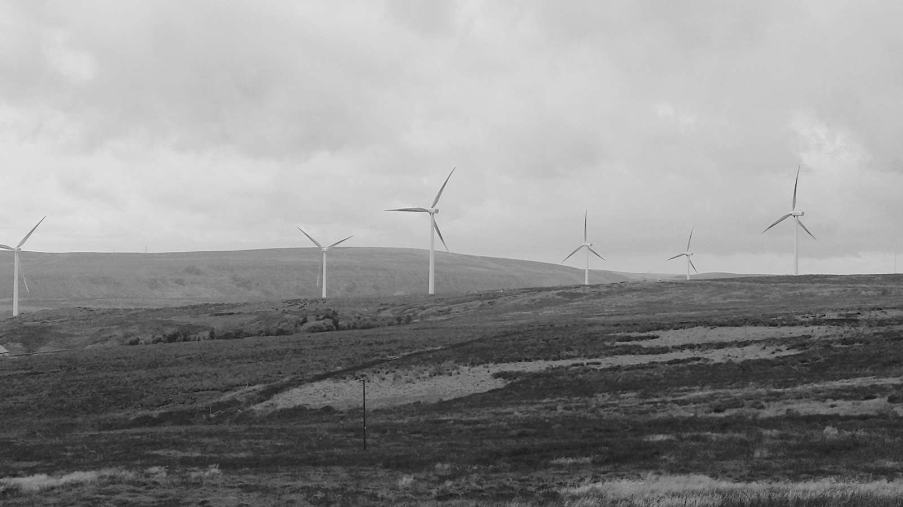
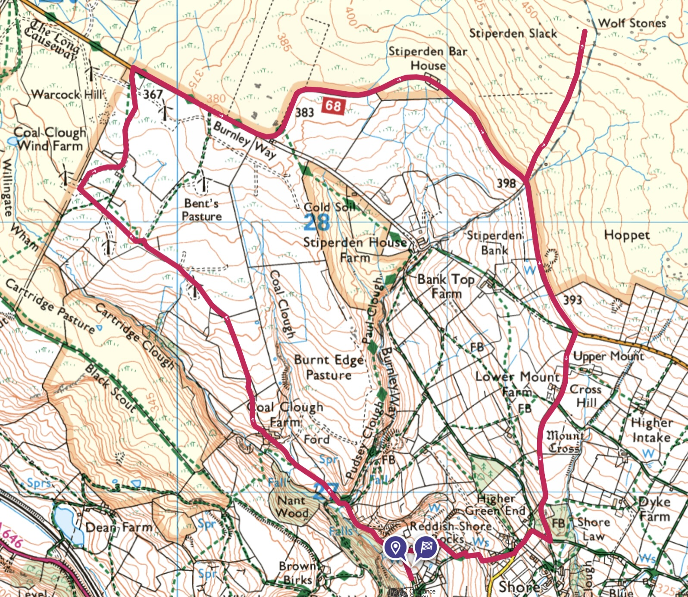
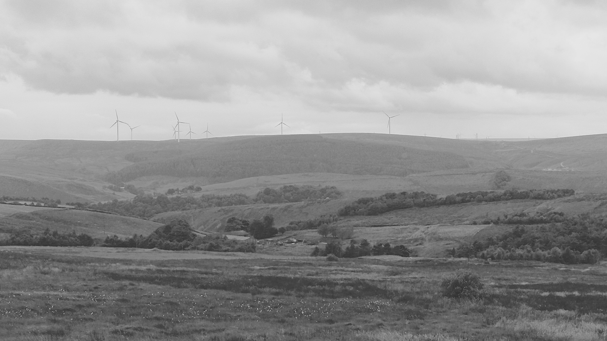
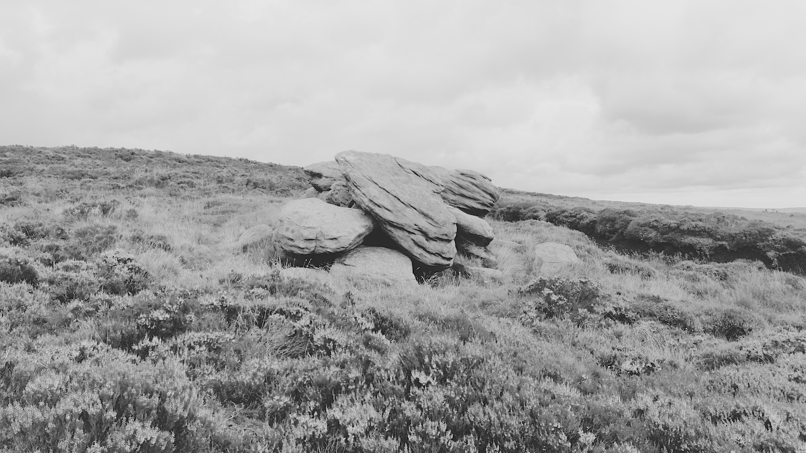
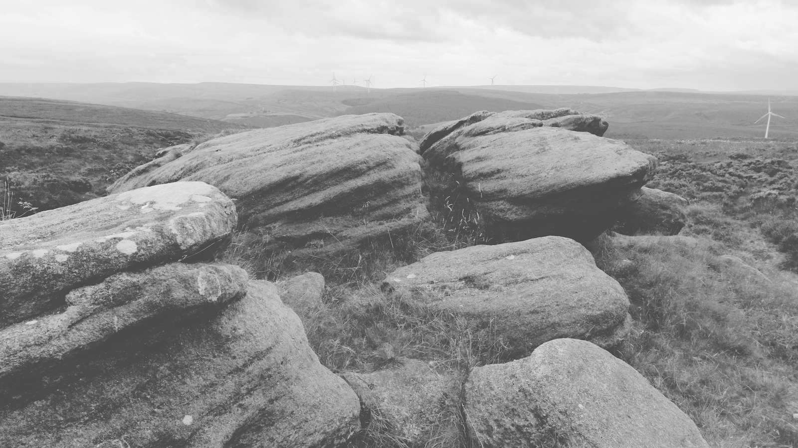

Date: Wednesday 7th August 2024

Quick loop up to Coal Clough wind farm, along Kebs Road/The Long Causeway, detour up to the Wolf Stones, then back down Pudding Lane. I had an older dog with me (that we're fostering for a month) so I avoided more scenic paths I knew had stiles and livestock, which meant more time walking along roads than usual.

[Ordnance Survey Route](https://explore.osmaps.com/route/22795193/pudsey-road-to-wolf-stones-loop?lat=53.759446&lon=-2.148509&zoom=13.0000&style=Leisure&type=2d)

**Distance: 4.86 miles**

### The Wolf Stones

