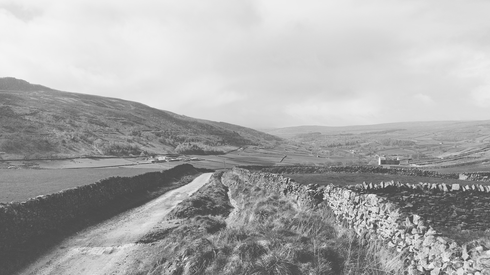

Date: 15th April, 2024

```
OS Grid Ref: SE 07018 62004
Latitude: 54°3'14"N
Longitude: 1°53'39"W
Altitude: 299m
```

Short child-free walk to celebrate our wedding anniversary. We parked at the top of Skyreholme Bank, which is probably frowned-upon but the farmers were friendly and we were the only walkers around. Heading North we took the left turn with Burhill Ridge to our right - ignoring the dozens of neolithic sites marked on the Ordnance Survey map. We then took a left over the moor towards Gill Head (again ignoring the temptation to find multiple cup marked stones) taking the right hand route around appropriately named Middle Hill, but not before following Skyreholme Beck for a while and finding the cave and disused mineshaft. To the north of Middle Hill at Gills Head we spotted more mines and realised we'd walked here before years ago. Once around Middle Hill we walked back up the stream to get a view of the mini Malham Cove-like gill. Finally onwards to Parcevall Hall and back to the car up Skyreholme Bank. 

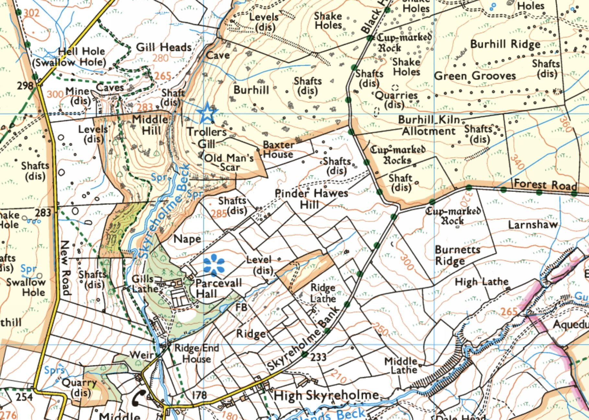

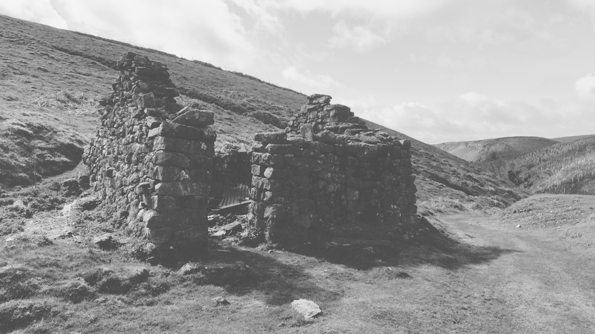
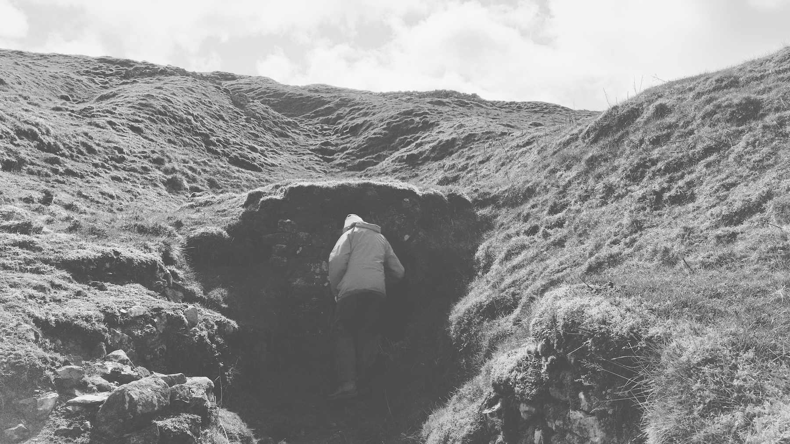
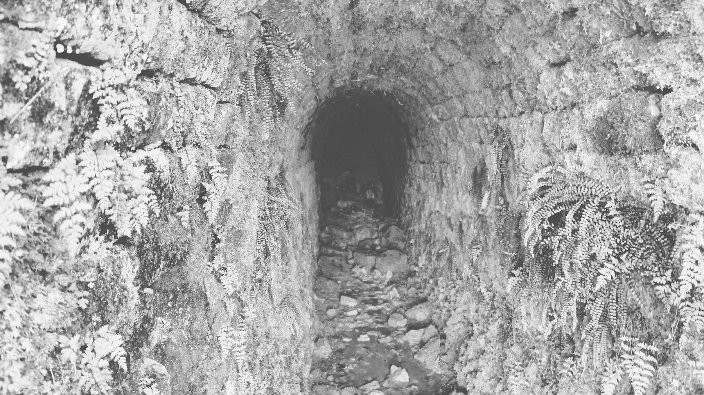

[Middle Hill](https://explore.osmaps.com/pin?lat=54.053821&lon=-1.898189&zoom=16.0000), between the two gills:
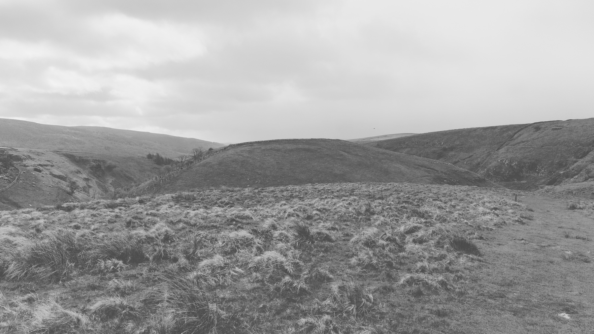

The northern gill full of old mine shafts:
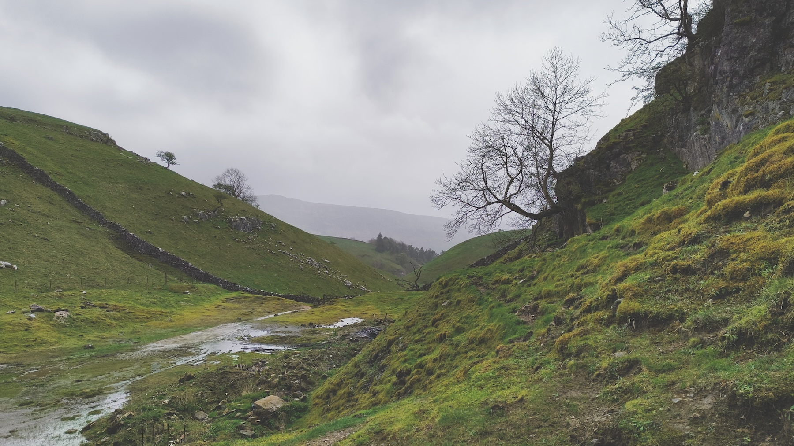
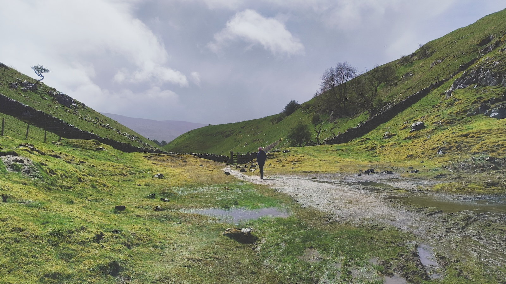

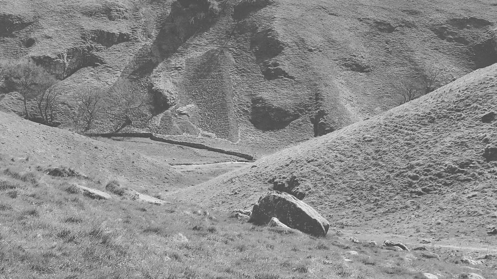
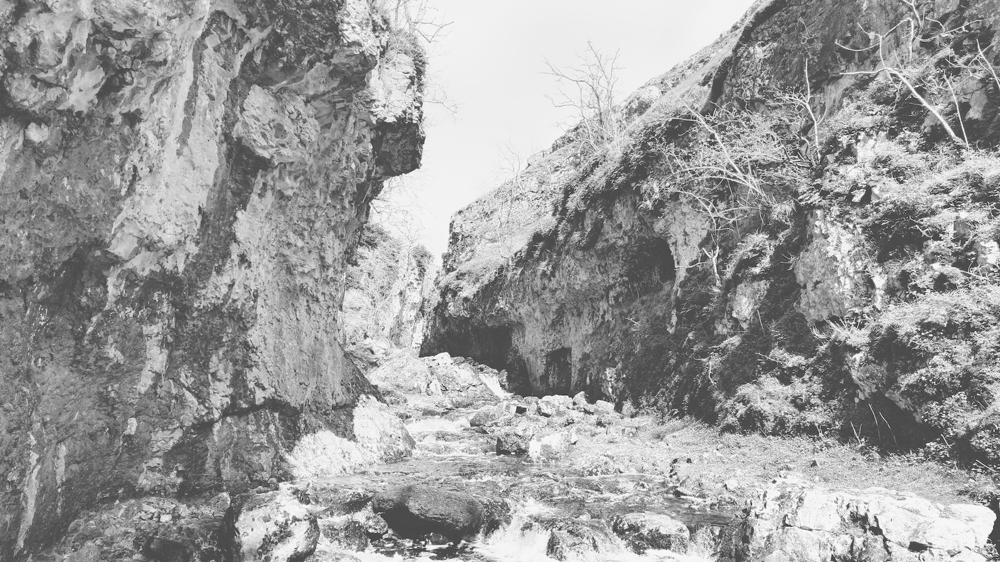
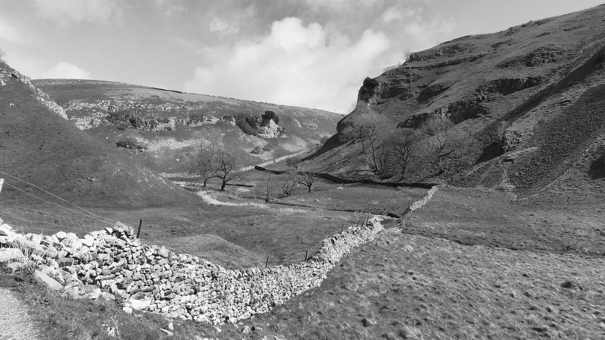