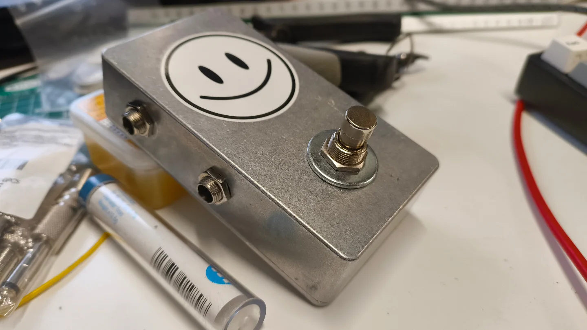

**Coming soon**

A momentary AB line switch for electric guitar. There's lots of standard latching AB switches available but the Orllewin MAB is momentary, the idea is you have your main effects chain and a secondary line you want to occasionally/briefly play a phrase on. The MAB is passive with a full bypass meaning it'll have no effect on your guitar signal. 

<small>Prototype MAB pedal</small>

