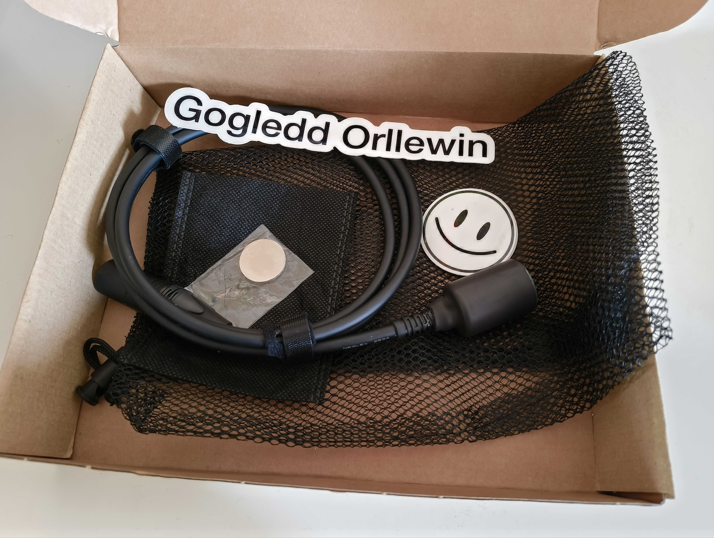

**Not available. Out of stock until further notice**
## About

The _Orllewin geophone_ is a cheap alternative to the famous [LOM Geofón](https://store.lom.audio/products/geofon). After noticing that the Geofón is usually sold out and seeing them being sold second-hand for ridiculous money (300 to 800 Euros) I created a budget solution. 

A field recording geophone is used to record audio from vibrations, sounds that wouldn't be picked up with regular microphones. They're a useful kit addition for field recorders, musicians, and for film and tv site recording. Scroll to the bottom for example recordings.

## Materials

The _Orllewin geophone_ uses the same 14Hz seismic sensor as the LOM but without the 3D printed casing. It uses the same high quality XLR plug, cable, and sensor, but uses a combination of two pieces of heat shrink tubing and a cable strain relief bushing boot to keep everything secure. A 1" disc magnet (included) can hold the geophone onto metal surfaces (any magnet will do, but if it's too strong you risk reducing the sensitivity of the geophone). 

**Geophone**: omnidirectional  
**Resonant frequency:** 14Hz  
**Frequency response:** 10 – 1000+ Hz  
**Cable:** 1.2m high quality Mogami 2534
**Connection:** Neutrik XLR

## Price

£75.00 (~88.00€) plus postage.
## Ordering

**Not available. Out of stock until further notice**

## Instructions

You'll get best results using a suitable preamp with gain control like the [iRig Pre2](https://www.ikmultimedia.com/products/irigpre2/) or the [Centrance MicPort](https://centrance.com/micportpro/). Alternatively a field recorder with an auto-level feature should be fine (eg. the [Zoom Handheld series](https://zoomcorp.com/en/us/handheld-recorders/) and [Zoom Field Recorder](https://zoomcorp.com/en/us/field-recorders/) series). If you're lucky enough to be able to afford them [Sound Devices](https://www.sounddevices.com/field-recording/) make high end field recording gear.

The geophone is very sensitive to movement (obviously), make sure you turn down any monitoring before handling it, once in position slowly increase the gain and monitoring level. Once you've finished recording turn the gain and monitor levels down fully before packing the geophone away. Make sure to turn **off** phantom power if it's available.

Keep it on its own in a soft bag with your other kit, and don't swing it by the lead, be gentle - the shrink tubing and strain relief bushing hold the cable in place but the solder joints to the seismic sensor are delicate. See bottom of this page for steps to fix.

It's not waterproof: **do not use as a hydrophone!**
## Example recordings

* A metal farm gate moving in the wind (Sourhall, Todmorden, March 2024, _Orllewin geophone_ into iRig Pre2 then a Zoom H1 recorder): 
* A suburban electrical box (York, March 2024, _Orllewin geophone_ into iRig Pre2 then a Zoom H1 recorder: 
* Some industrial fencing next to a busy road in York, (York, March 2024, _Orllewin geophone_ into iRig Pre2 then a Zoom H1 recorder: 
## Repairs

The seismic elements have two small protruding terminals which the audio cable is soldered onto. This is the weak point in the system and if you lose audio it's the likely culprit. If you have experience with soldering and basic wiring you can use some small scissors to remove the shrink tubing and repair yourself:

* Carefully cut a clean line through the shrink tube casing from bottom to top. Leave connected at the strain relief bushing.
* Evaluate the connection: push the strain relief bushing and shrink tubing up the cable an inch or two.
* Important: note which coloured wire attaches to which terminal on the seismic element. 
* Either solder the connection in place or lose an inch of cable and start afresh.
* Check the audio is working again.
* Push the strain relief bushing back down over the soldered terminals, pull the shrink tubing cover together and fix in place with electrical tape. Optionally add some glue to the top of the bushing to keep the cable from moving relative to the sensor.

I can repair broken Orllewin geophones in the UK for a small fee. 