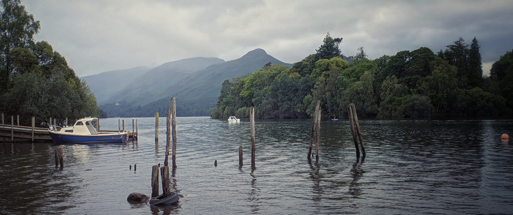

<small>Martindale, Cumbria, taken with Lento and the Moment Anamorphic lens.</small>

## Platform

Android

## About

A full Android camera app that applies LUTs to photos and also supports de-squeezing images taken with an anamorphic lens. Uses the notoriously awful Android Camera API, not the old bad API, the newer bad API, which has probably now been replaced by an even newer bad AndroidX API. I still use this daily, it's fantastic. Has interop with [LUT Film Package](LUT%20Film%20Package.md).

<small>CMF Phone 1 with a cheap clip-on anamorphic lens</small>

The old webpage is at: [orllewin.github.io/android/lento/](https://orllewin.github.io/android/lento/) but it's not available on Google Play since I gave up trying to keep up with Google's ever changing requirements, it is available on itch.io though: [orllewin.itch.io/lento](https://orllewin.itch.io/lento) . 

An old hacked together Javascript gallery is at: [orllewin.github.io/android/lento/gallery/001/](https://orllewin.github.io/android/lento/gallery/001/)

<small>A film simulation LUT with the signature 1980s colours</small>

## Download

 [orllewin.itch.io/lento](https://orllewin.itch.io/lento)

### Code

[github.com/orllewin/lento](https://github.com/orllewin/lento)(Private)

## Status

Archived. Lento 2 is in progress, and has been for years.

---

<small>Martindale, Cumbria</small>

