Manage and stream your favourite netradio stations.

<iframe frameborder="0" src="https://itch.io/embed/2773347" width="700" height="167"></iframe>

A [Radio](Radio.md) implementation using up-to-date Android dependencies (as of June 2024). Written fully in Compose, with the latest [androidx.media3](https://developer.android.com/jetpack/androidx/releases/media3) libs for media handling, and a [Content Provider](https://developer.android.com/guide/topics/providers/content-providers) for accessing the artwork from Android Auto. 

All stations are stored locally on the device in a [Room database](https://developer.android.com/training/data-storage/room) (injected with [Hilt](https://developer.android.com/training/dependency-injection/hilt-android)) with a search feature calling the [www.radio-browser.info](https://www.radio-browser.info/) service. The interface is themed using [Material You](https://material.io/blog/announcing-material-you), so it'll inherit colours from your wallpaper and also follow the phone's light/dark status.

<iframe width="700" height="500" src="https://www.youtube.com/embed/XJcpdD2LnnM" title="Radio for Android quick walkthrough." frameborder="0" allow="accelerometer; autoplay; clipboard-write; encrypted-media; gyroscope; picture-in-picture; web-share" referrerpolicy="strict-origin-when-cross-origin" allowfullscreen></iframe>

| Onboarding | Large grid | Edit list|
| :--: | :--: | :--: |
| 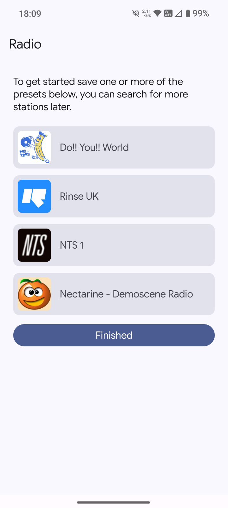 | 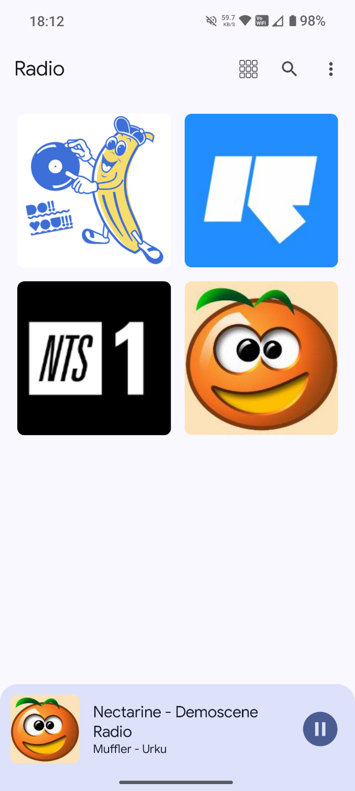 | 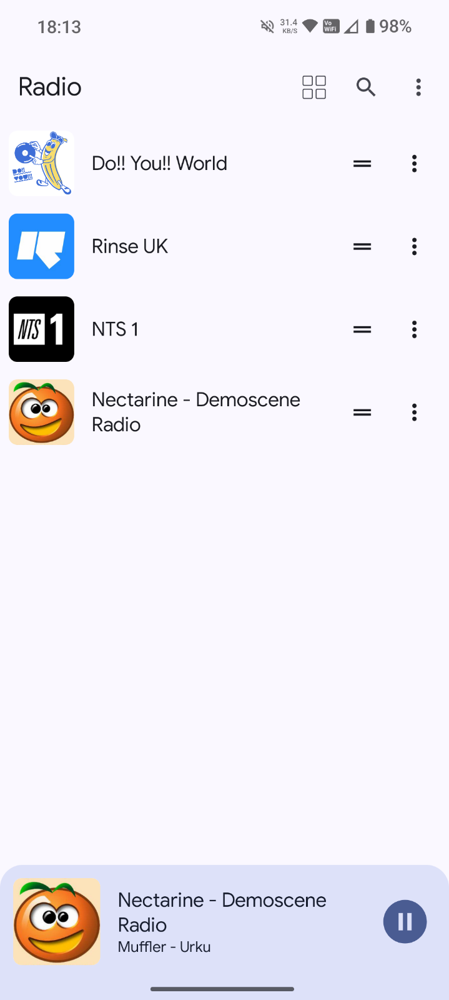 |

| Search | Station edit | About dialog|
| :--: | :--: | :--: |
| 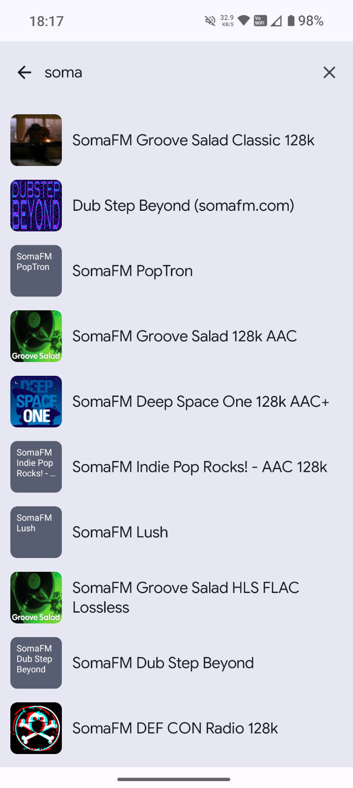 | 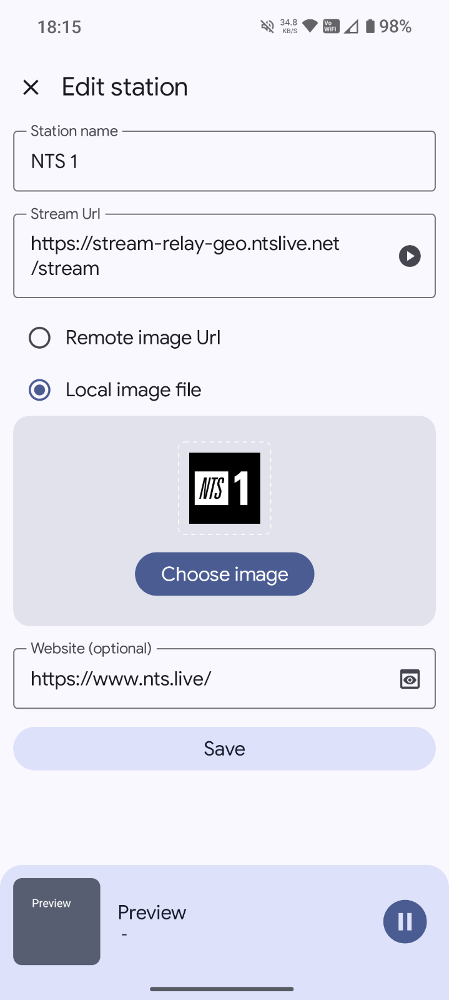 | 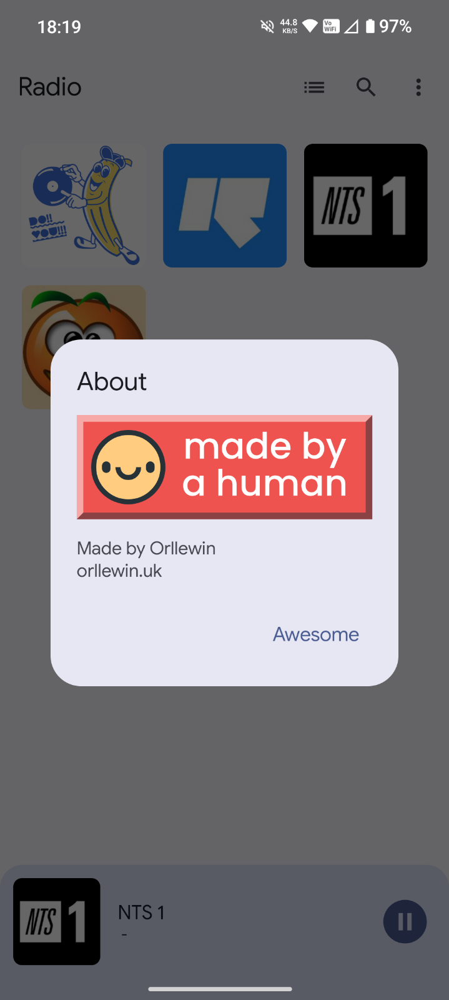 |

## Status

Currently active but I'm putting more energy into [Control](Control.md) which will be able to do everything this can and more. 

Buy and download on itch.io: [orllewin.itch.io/radio](https://orllewin.itch.io/radio)

## Enabling Android Auto

Android Auto apps generally need to be installed from Google Play but side-loaded apps can work too. Follow the steps below to use Radio from your car.

| 1. Android Settings | 2. Search for Android Auto | 3. Tap 'Additional settings in the app'|
| :--: | :--: | :--: |
| 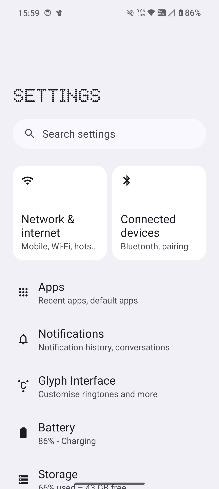 | 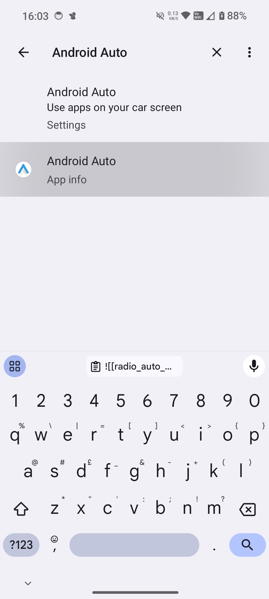 | 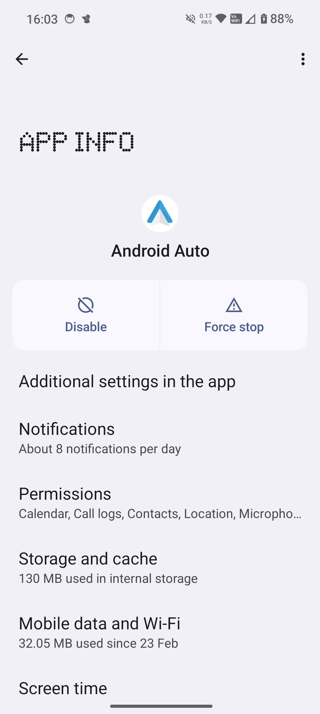 |

| 4. Android Auto app home | 5. Scroll down to version | 6. Start tapping the version layout|
| :--: | :--: | :--: |
| 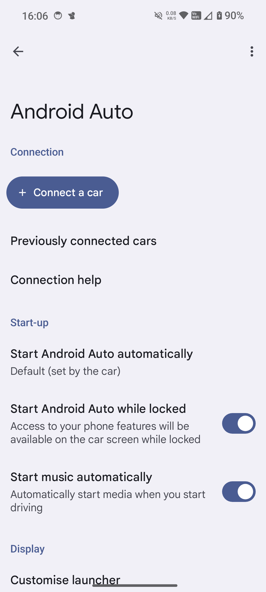 | 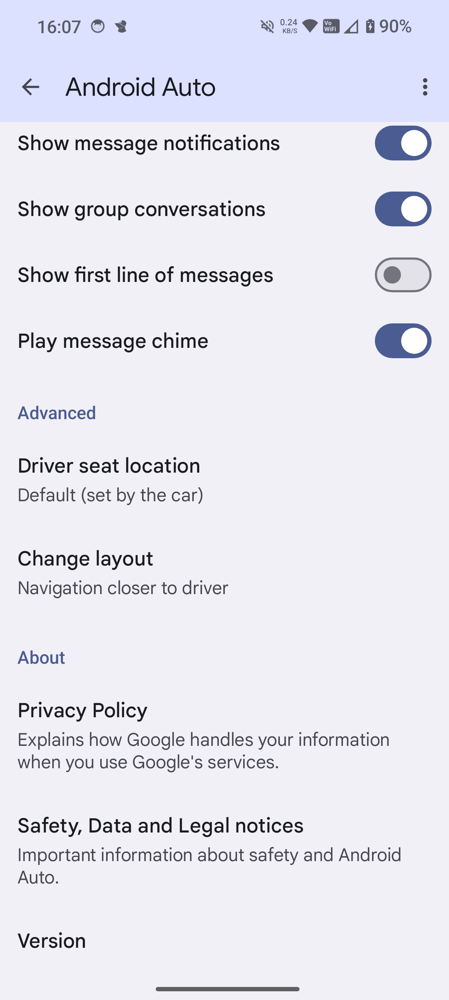 | 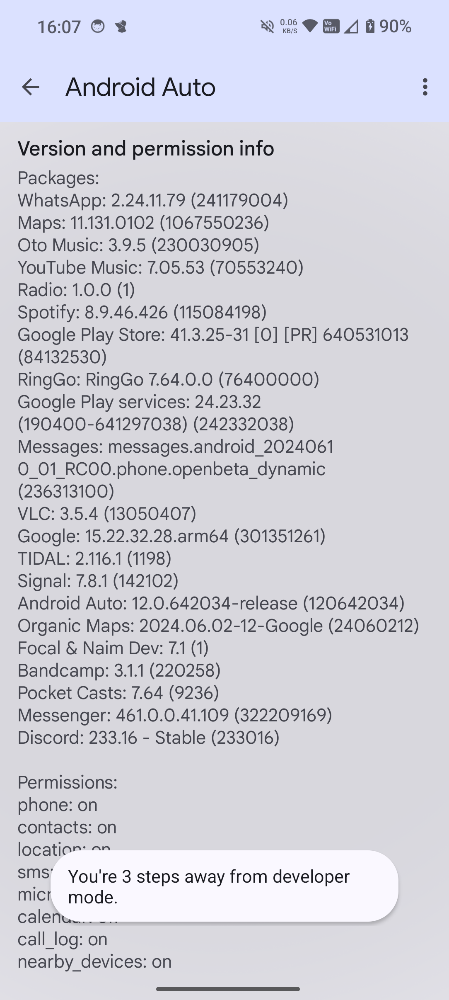 |

| 7. Read this, tap OK | 8. Open the overflow menu, tap Developer Settings | 9. Scroll down and enable 'Unknown sources'    |
| :--: | :--: | :--: |
| 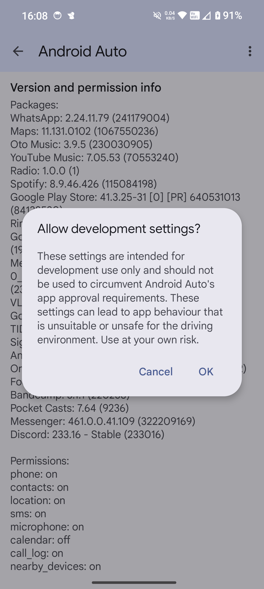 | 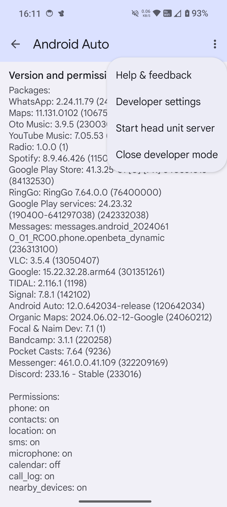 | 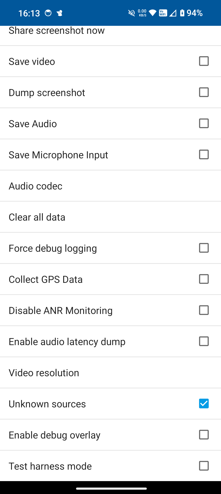 |

