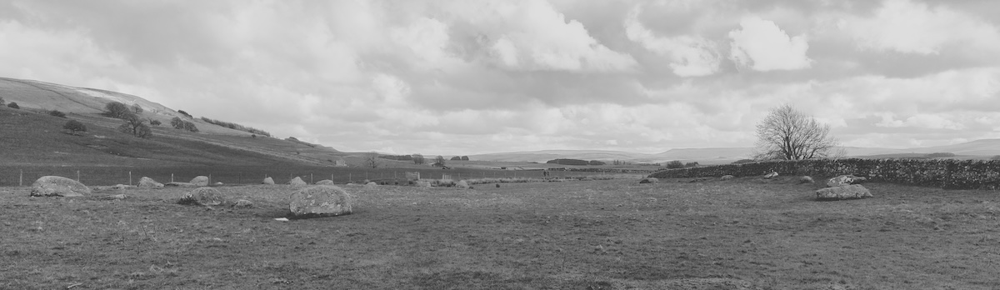
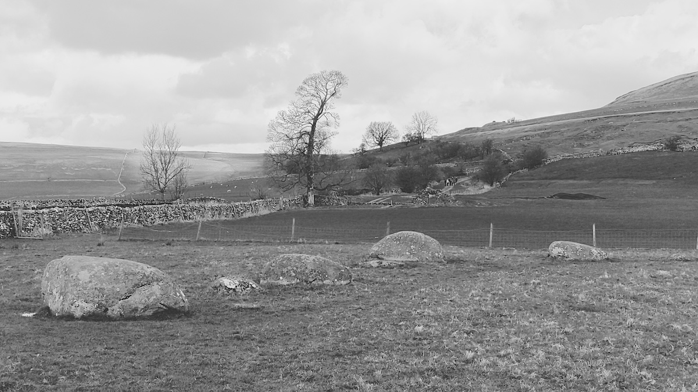
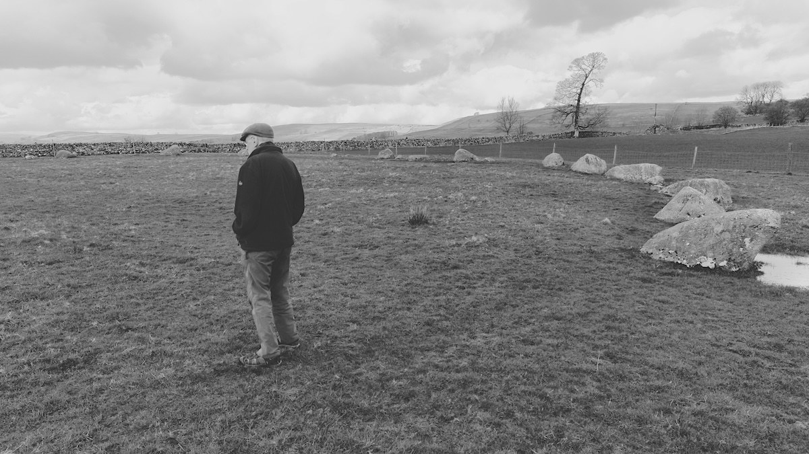

<small>The circle is quite large, so difficult to photograph from the ground</small>

Visited: 30th March 2024

Also known as Orton Stone Circle.



### 54.467618 -2.556776

[Ordnance Survey Pin](https://explore.osmaps.com/pin?lat=54.467618&lon=-2.556776&zoom=15.7782&style=Leisure&type=2d)

```
OS Grid Ref: NY 64010 08170
Latitude: 54°28'3" N
Longitude: 2°33'24" W
```


<small>The circle being inspected by father-in-law</small>


## Links
* [megalithic.co.uk](https://www.megalithic.co.uk/article.php?sid=927)
* [stone-circles.org.uk](http://www.stone-circles.org.uk/stone/gamelands.htm)
* [visitcumbria.com](https://www.visitcumbria.com/evnp/gamelands-stone-circle/)