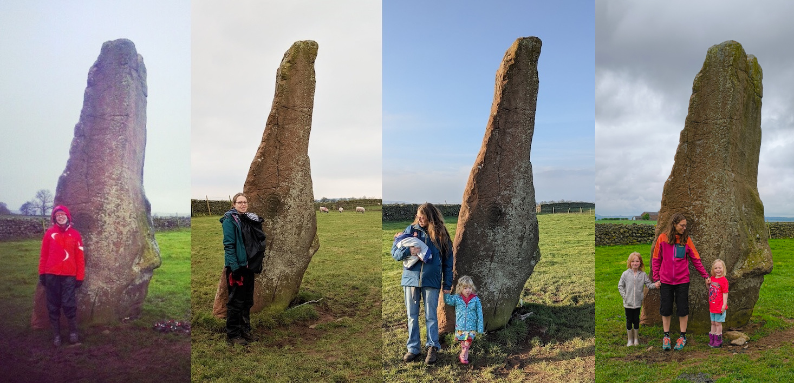
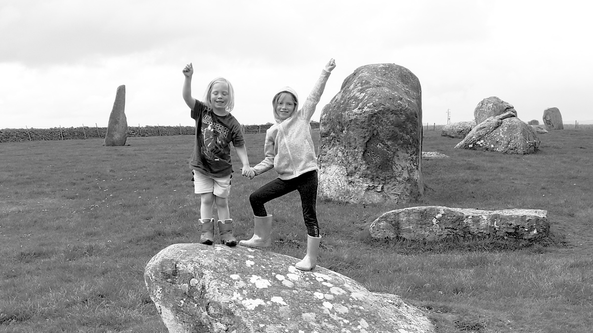
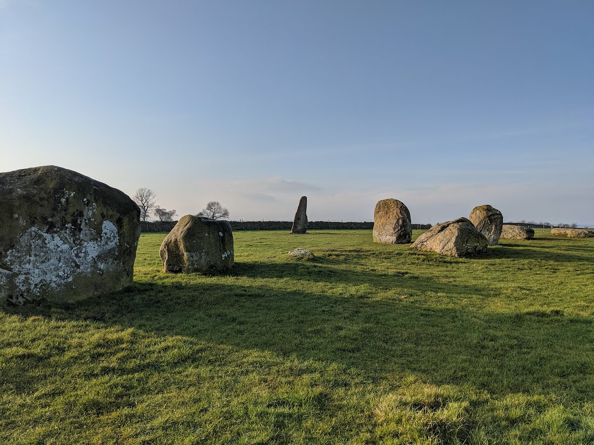
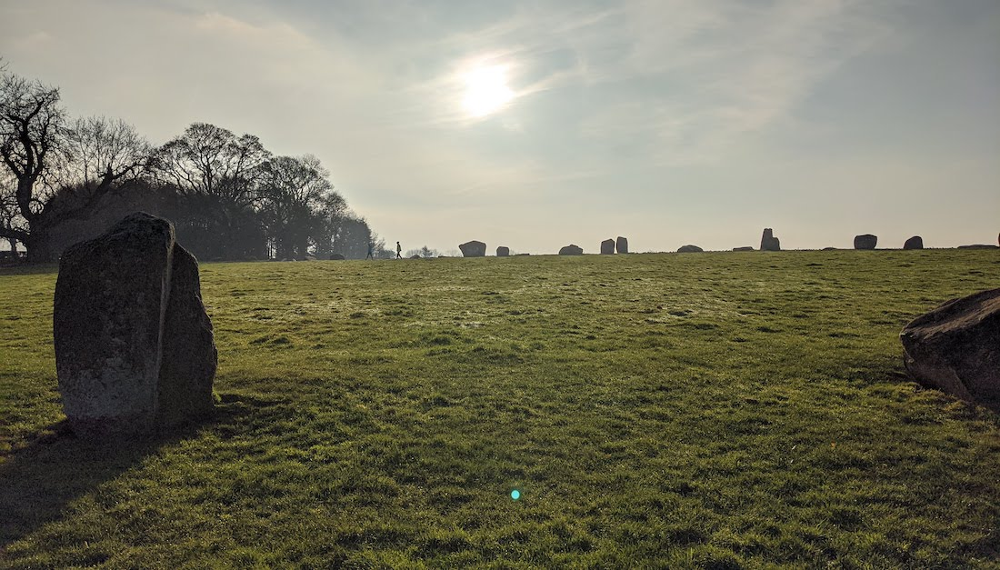
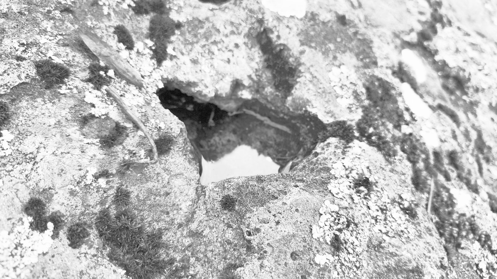

**Long Meg & Her Daughters Stone Circle, Cumbria**



[OS Grid Ref: NY 57130 37169](https://osmaps.ordnancesurvey.co.uk/54.72767,-2.66718,17/pin)

```
Geo URI: geo:54.7276,-2.6671
Latitude: 54° 43' 39" N 
Longitude: 2° 40' 1" W
```


<small>May 6th 2024 visit</small>


<small>Long Meg & Her Daughters Stone Circle, a wider photo showing some of the huge circle</small>




<small>P called these little pools of water on top of the stones 'spider puddles'</small>
