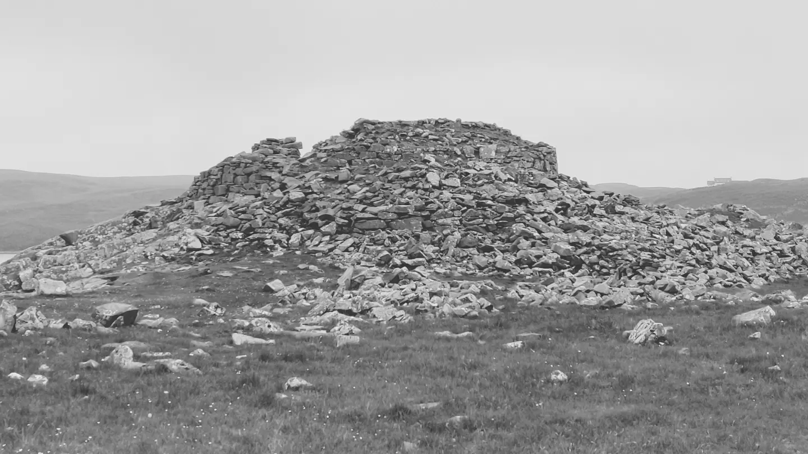
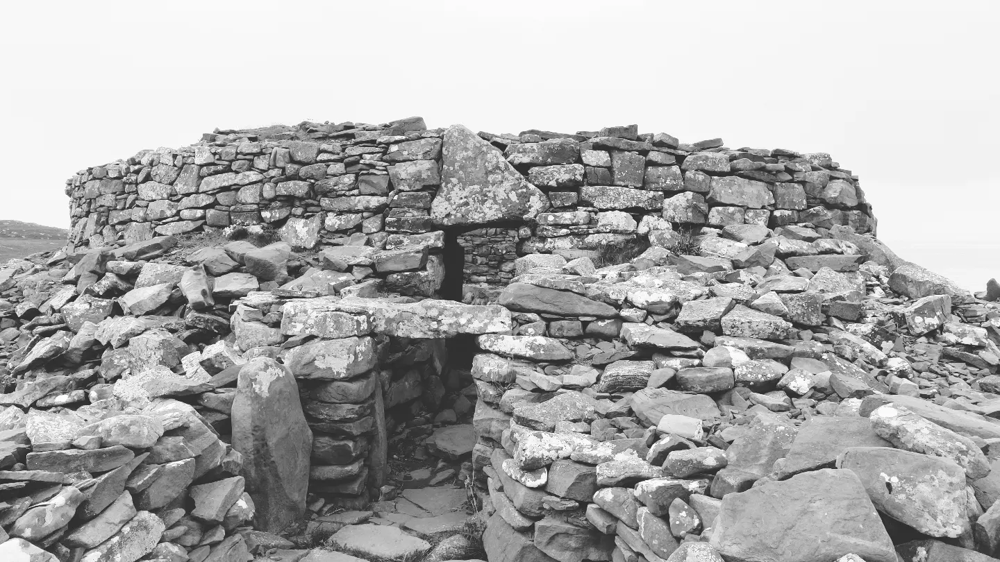
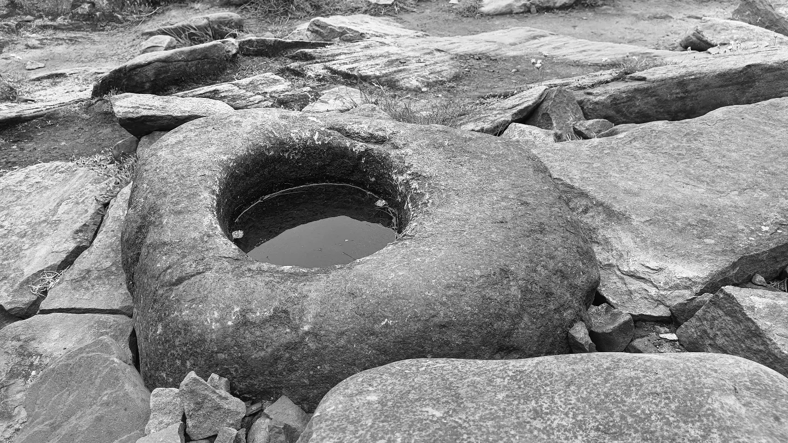
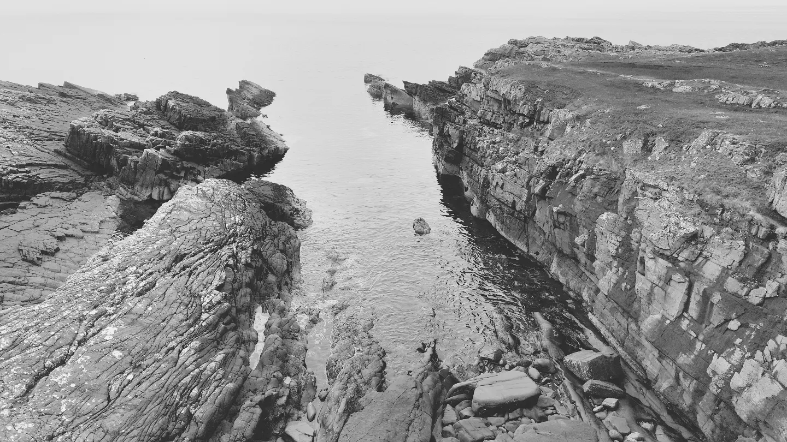
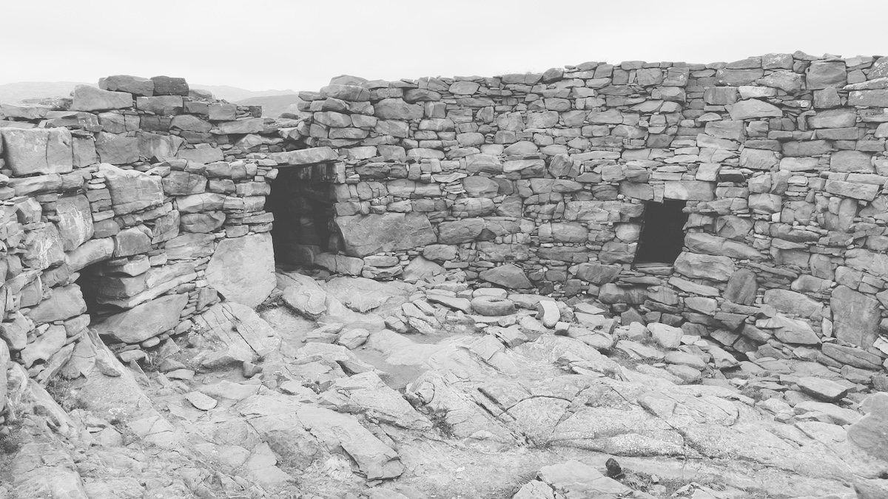
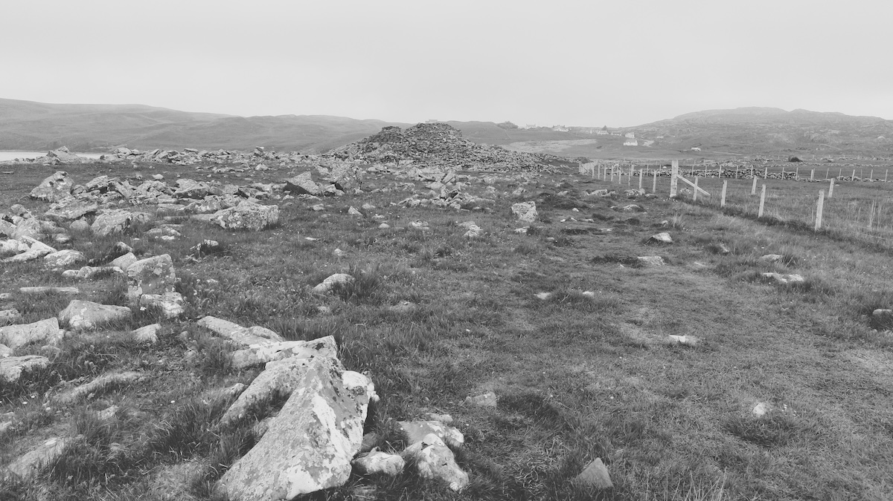

Date visited: 29th May 2024



## 58.1955727,-5.3428417

[Ordnance Survey Pin](https://explore.osmaps.com/pin?lat=58.195559&lon=-5.342314&zoom=15.9857&style=Leisure&type=2d)

```
OS Grid Ref: NC 03659 27843
Latitude: 58°11'44"N
Longitude: 5°20'32"W
```




<small>Small calm slipway into the sea right next to the broch</small>


<small>The main entrance in the middle, and two dark side rooms either side</small>


<small>First view of the broch approaching from Clachtoll caravan site</small>
## Links
* [clachtollbroch.com](https://www.clachtollbroch.com/)
* [canmore.org.uk](https://canmore.org.uk/site/4499/clachtoll)
* [megalithic.co.uk](https://www.megalithic.co.uk/article.php?sid=913669681)