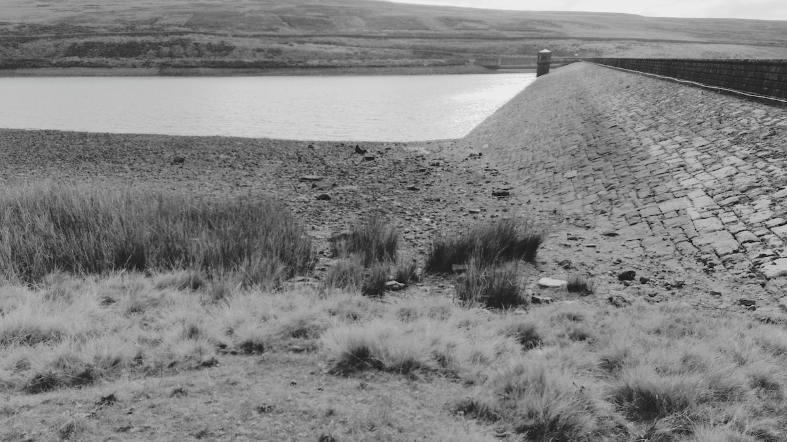
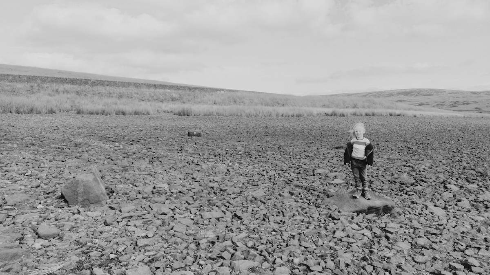
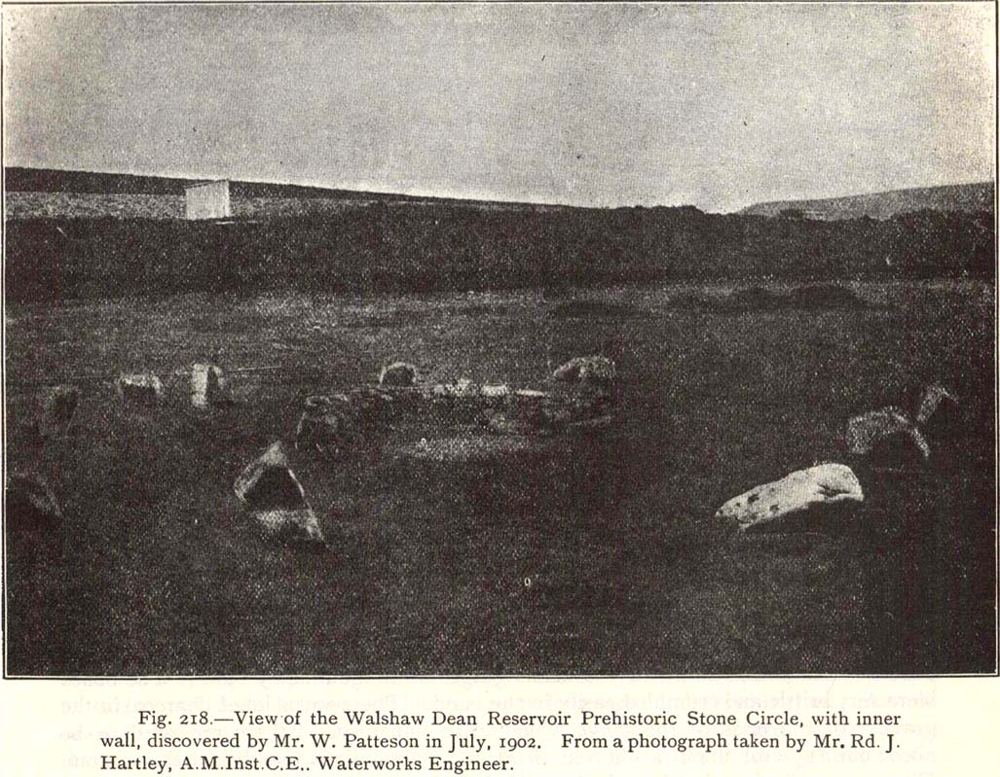
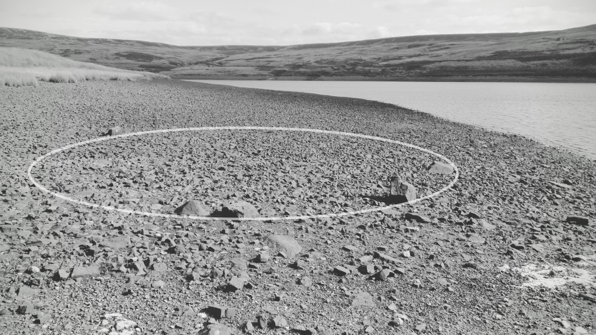
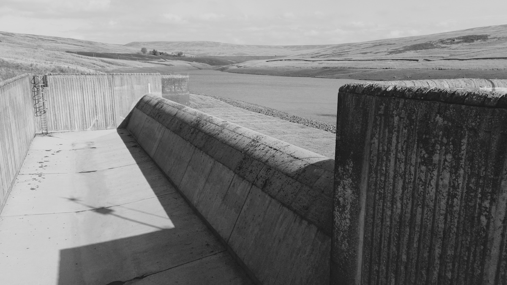

Date visited: 5th October 2024

A 'lost' circle thought to have been destroyed when the Victorians built the reservoirs, the engineers actually took the first photo of it in 1902 and it's always been just below the surface. 

Best visited in late summer for obvious reasons, you wont see it otherwise.


<small>The circle is just by the dam of the middle reservoir</small>
## 53.798474, -2.055182

[Ordnance Survey Pin](https://explore.osmaps.com/pin?lat=53.798474&lon=-2.055182&zoom=15.8477&style=Leisure&type=2d)

```
OS Grid Ref: SD 96462 33575
Latitude: 53°47'55"N
Longitude: 2°3'19"W
```


<small>P for scale. The middle stone from the 1902 photo below is missing</small>


<small>From The Modern Antiquarian (see link below)</small>


<small>A circle overlay showing the original stone circle perimeter</small>

## Links
* [megalithic.co.uk](https://www.megalithic.co.uk/article.php?sid=1336)
* [[The Northern Antiquarian](https://megalithix.wordpress.com/ "The Northern Antiquarian")](https://megalithix.wordpress.com/2011/12/16/walshaw-dean/)


<small>Bonus concrete infrastructure photo</small>